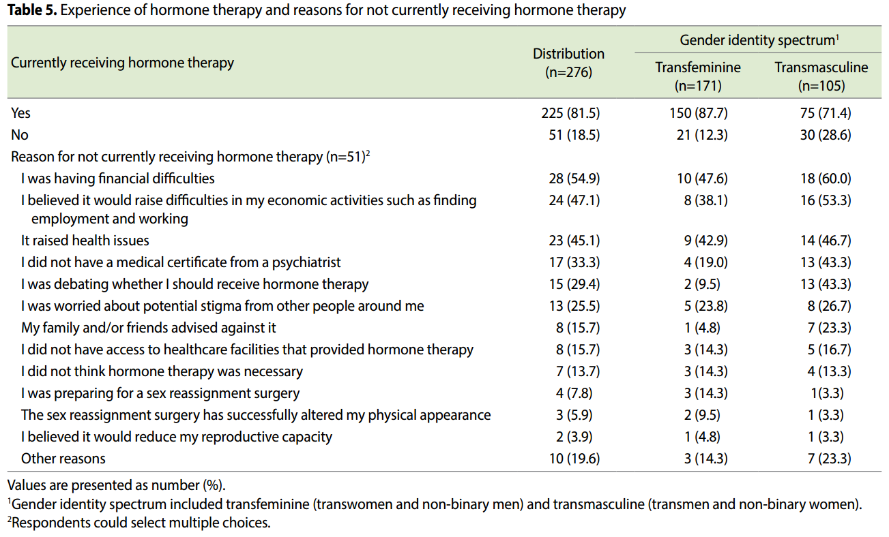
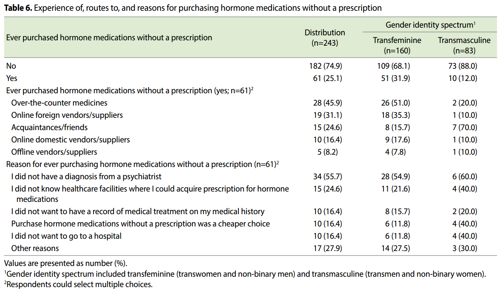

# Experiences of and barriers to transition-related healthcare among Korean transgender adults: focus on gender identity disorder diagnosis, hormone therapy, and sex reassignment surgery
## Lee et al 2018

**This study aimed to investigate the experiences of transition-related healthcare and barriers to those procedures among transgender adults in Korea**

**We assessed the prevalence of transition-related healthcare, including gender identity disorder (GID) diagnosis, hormone therapy, and sex reassignment surgery. To understand the barriers to those procedures, we also asked participants for their reasons for not receiving each procedure. Further, this study examined their experiences of and the reasons for using non-prescribed hormone medications**

## Population

> "Among the total study population, 173 (62.2%) were transfeminine and 105 (37.8%) were transmasculine. Of all respondents, 218 (78.4%) were 19-29 years and 60 (21.6%) were 30-50 years old, indicating that the majority were in their 20s (Table 2)." ([Lee et al 2018:3](zotero://open-pdf/library/items/A3HGTUSH?page=3))

> "For those who have purchased non-prescribed hormone medications, they were asked to report the route of access and the reasons why." ([Lee et al 2018:3](zotero://open-pdf/library/items/A3HGTUSH?page=3))

## Access to Care//Implications of Care

> "In Korea, access to transition-related healthcare is critical not only for reducing transgender individuals' own gender dysphoria, but also for institutional factors, such as legal sex change and exemption from military service [7,11]. Legal sex change is based on "The Guidelines for the Handling of Petition for Legal Sex Change Permit of Transgender People" in Article 435 of the Supreme Court Family Relation Registration Regulation in Korea [12,13]. The regulation requires applicants to receive a psychiatric diagnosis of GID, remove reproductive capacity, and have sex reassignment surgery through investigative matters and compulsory documentation" ([Lee et al 2018:2](zotero://open-pdf/library/items/A3HGTUSH?page=2))

> "Further, all individuals whose legal sex is male and who have Korean nationality are obliged to serve in military services, as mandated by the Military Service Act and Article 39 (1) of the Constitution of Korea. This obligation also applies to transwomen who do not change their legal sex at birth [14,15]. Under such circumstances, transwomen who wish to be exempt from military service must obtain a GID diagnosis, receive hormone therapy, and even undergo sex reassignment surgery [11,14,15]. Transmen are also required to have a physical examination for military service after changing their legal sex to male [14]." ([Lee et al 2018:2](zotero://open-pdf/library/items/A3HGTUSH?page=2))

> "transgender individuals are burdened with the entire cost of hormone therapy and sex reassignment surgery because those medical procedures are not covered by national health insurance" ([Lee et al 2018:2](zotero://open-pdf/library/items/A3HGTUSH?page=2))

> "Among transgender respondents, those whose legal sex at birth was male and currently identifying as woman were classified as transwomen, whereas those whose legal sex at birth was female and currently identifying as man were classified as transmen. Respondents who identified as neither man nor woman were categorized as non-binary transgender people. In this study, non-binary transgender individuals and transwomen whose legal sex at birth were male were classified as transfeminine, whereas non-binary transgender individuals and transmen whose legal sex at birth were female were classified as transmasculine [4]." ([Lee et al 2018:3](zotero://open-pdf/library/items/A3HGTUSH?page=3))

> "Among 262 participants, 112 (42.7%) reported that they themselves had delayed or avoided hospital visits, and 14 (5.3%) reported that they were denied healthcare services within the past 12 months. According to a previous survey about discrimination based on sexual orientation and gender identity in Korea, 28 of 78 trans gender respondents (35.9%) who visited healthcare institutions within the past 5 years reported that they experienced discrimination from healthcare professionals [18]." ([Lee et al 2018:9](zotero://open-pdf/library/items/A3HGTUSH?page=9))

## Non-prescription Hormone Use

> "The prevalence of hormone therapy also was significantly higher in the transfeminine group (n=160/171, 93.6%) and 30-50-yearold group (n=58/59, 98.3%) than in the transmasculine group (n=83/105, 79.0%) and 19-29-year-old group (n=185/217, 85.3%)" ([Lee et al 2018:4](zotero://open-pdf/library/items/A3HGTUSH?page=4))

> "Reason for ever purchasing hormone medications without a prescription (n=61)" ([Lee et al 2018:8](zotero://open-pdf/library/items/A3HGTUSH?page=8))

> "In this study, 25.1% of 243 transgender participants reported purchasing non-prescribed hormone medications" ([Lee et al 2018:10](zotero://open-pdf/library/items/A3HGTUSH?page=10))

## Interesting Figures

![Table "modified from Reisner et al. Lancet 2016;388:412-436 [4]." ([Lee et al 2018:3](zotero://open-pdf/library/items/A3HGTUSH?page=3))](./lee2018/lee2018-table1.png)

