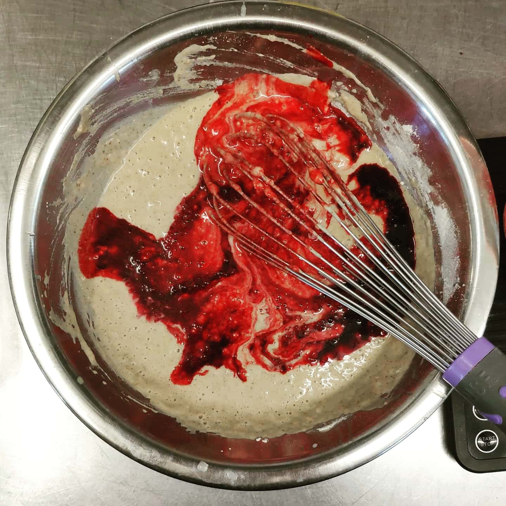
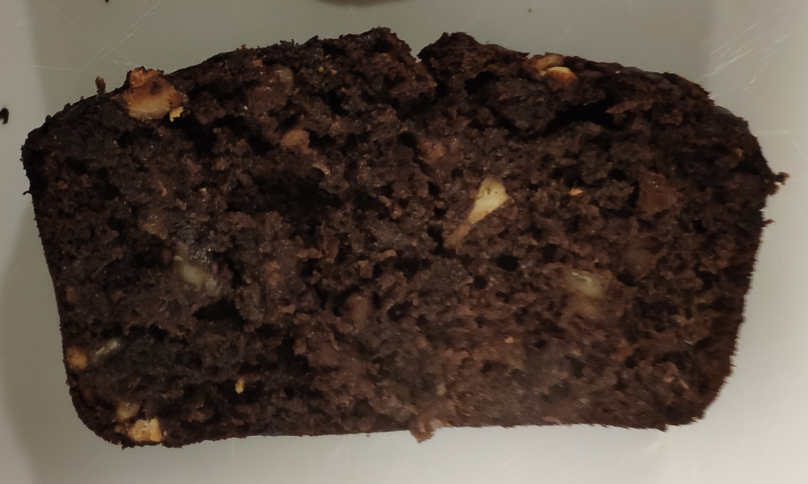
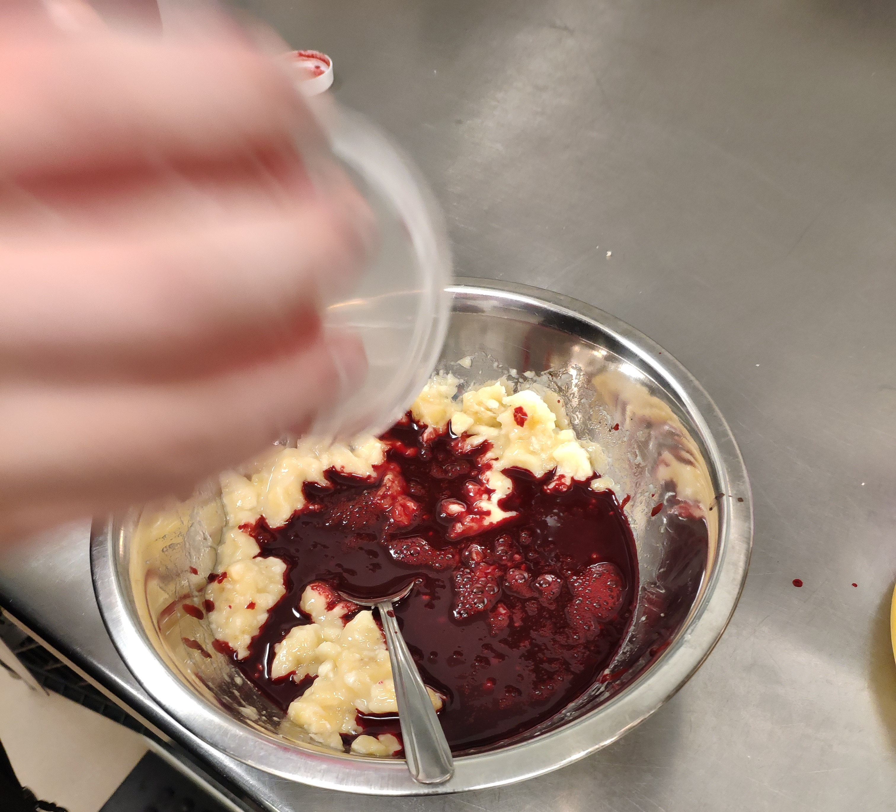
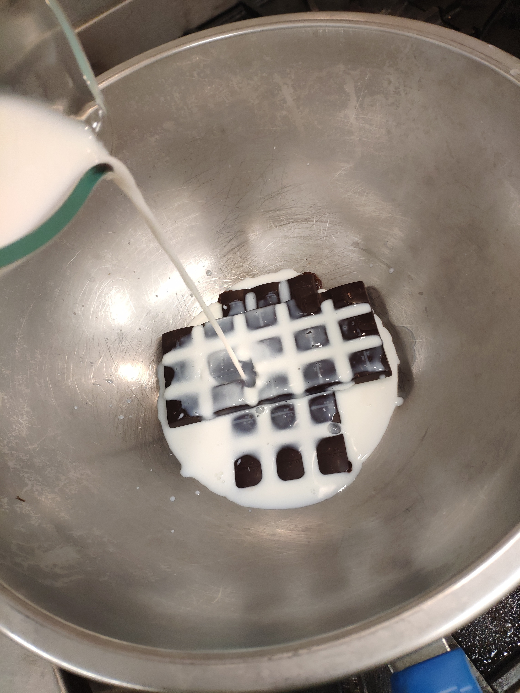

# A Vampires Guide to Anemia

Right now: THIS IS A DRAFT! 

pls read with that in mind; be kind.

## Introduction

I cook with blood. Why? Cause it's cool. And sometimes it tastes good; it's high in iron and fights anemia. Here, I've included the recipe hits (and failures!), how to get your own blood and some thoughts on the ethics of it all. Enjoy!

## Ethics of Blood Consumption

>Iron deficiency affects more people than any other condition, constituting a public health condition of epidemic proportions. More subtle in its manifestations than, for example, protein-energy malnutrition, iron deficiency exacts its heaviest overall toll in terms of ill-health, premature death and lost earnings.[^who-iron]

Iron deficiency anemia is the most common nutritional deficiency in the world[^who-iron] and the heme-iron form of iron (which is found in meats, organs and blood) is the most bio-available natural^[Aside from breast milk and dirt] iron source available. Iron deficiency anemia rates are not equal across demographics - women are by far the most affected, but infants and children are also heavily affected. Today, more than 1.6 billion suffer from anemia^[https://www.who.int/vmnis/anaemia/prevalence/summary/anaemia_data_status_t2/en/], mostly due iron deficiencies^[??]. Even in the US, iron deficiency anemia isn't uncommon^[https://ods.od.nih.gov/factsheets/Iron-HealthProfessional/]. Almost 47% of preschool-age children have anemia, and anemia contributes to 20% of all maternal deaths[^who-iron]. 

Put simply, it's a *big* problem. If you're female (or estrogen haver), there's a large chance^[how large?] you've either been anemic or *will* be anemic.

> "I was woken up when my body hit the floor. My first thought was 'Sophia, why did you lie down on the bathroom floor? You're in your pajamas.'" - My anemic friend, Sophia

Luckily, the solution is seemingly simple. The World Health Organization (WHO) breaks their strategy to reduce world wide anemia rates into a three part plan[^who-iron]:

1. Increase iron intake
2. Control infection^[Meaning Immunization and control programs for malaria, hookworm and schistosomiasis. In many developing countries, iron deficiency anaemia is aggravated by worm infections, malaria and other infectious diseases such as HIV and tuberculosis.[^who-iron]]
3. Improve nutritional status

To accomplish these goals, the WHO has developed a  "comprehensive package of public health measures." However, while we wait for large scale change, billions of people have an immediate need to improve their situation.

Adding blood to your diet accomplishes the first and most important components of the WHOs plan to beat anemia. If you don't have access to fortified cereals or supplements^[I don't want to encourage anyone to not seek out these arguably better methods of intaking iron. That said, if you need iron supplementation and aren't getting it through fortified foods or supplements because of availability or associated gastrointestional issues, blood represents an alternative method of increasing iron intake. Find what works for you, but find it.], the simple addition of blood to a meal can make sure you intake enough iron. 

But where does one get blood to cook with in the first place?

> Of all [slaughter house] waste products, the waste in the form of blood has the highest polluting value. Blood itself has a high BOD: 150,000 - 200,000 mg/l, the extreme value being 405,000 mg/l. (Domestic wastewater has a BOD of 300 mg/l). In the killing, bleeding and skinning phases, **blood is produced which, when completely sewered, leads to a total waste load of 10 kg BOD per ton of LWK. A waste load of up to 3.0 kg BOD per ton of LWK may occur in wastewater flowing out of the killing-area and the hide-removal-area.** ([source](www.fao.org/3/x6114e/x6114e04.htm#b12-2.3.2.1.%20Wastewater%20by%20red%20meat%20slaughtering))

Many slaughter houses have so much excess blood that, even after selling what they can for fertilizer/pig feed/other uses, they still dump tonnes down the drain. Butchers do much of the same^[source?], but seem more willing to sell blood to customers if they ask^[source?]. In my case, I simply had to ask and I got blood for free in a win-win situation: I got blood and they got the blood off their hands. (see [Sourcing Blood](#sourcing-blood) for details).

In this light, adding blood into your cooking repertoire is a classic ecofeminist move^[If, say, we started to consume *so* much blood that animals were being killed just to produce it *then* that would be a problem. I don't think we're going to get there any time soon], - it empowers women to improve their own health through accessible and ecofriendly action. And on top of that, if you're able to get your blood for free, you're not supporting the killing of the animal, only making sure that everything produced gets used.

Blood consumption where an animal wasn't killed toes the ethical boundaries developed by Ethical Vegetarianism/Veganism. As long as you're not contributing to the killing animals and simply diverting blood from a environmentally taxing disposal pathway, you're in the green.

Blood consumption may also help address some commonly cited problems with vegetarianism/veganism, namely inaccessibility (eg. the high price of plant based diets in some parts of the world). Veganism in the United States^[This is not the case in France (at least according to the numbers) nor in places where vegetarianism is considered the norm.] is often considered a thing of privilege, especially along lines of socioeconomic status, race/ethnicity and education. Further compounding issues of privilege, anemia rates are *heavily* correlated with socioeconomic status, at least in children (even when you control for red meat consumption, BMI, Age etc.):

Rate of Child Anemia vs Socioeconomic Status in Tennessee, Rural China, Korea and various Low and Middle Income Countries ([how I made this figure](./blood/data/Anemia-Rate-Figure-Generation.html))

Similar trends (as one might predict) can be seen across educational and racial gradients (not shown here).

> Your health and my health are reflexive of one another, and their health hangs in this balance. (PMS Vol1)

Until a vegetarian/vegan diet is _attainable_ and doesn't put you at _risk_ of anemia I proffer vegetarianism+ and veganism+ where the plus represents blood consumption as practical and more ecofriendly alternative.

I don't expect everyone will call multiple farms and ask for blood (see my notes on sourcing below) - that would be like suggesting yoga to a depressed person^[If you can get your blood from a farmer, that's *almost certainly* the right move. Sourcing locally means better quality and less ecological impact.]. However, if you've got a local butcher: ask them if they can save you some blood! Make a dish! Fight back by fighting anemia, channel your inner vampire. Killing animals is probably unethical. Eating blood doesn't have to be.

## The Gross Factor

I've been banned from talking about blood at home.

> "Cooking with blood is probably the least kosher activity in existence" - My friend Ash

> "I was really expecting to be grossed out, but then it was... fine. I thought it'd be thick but it wasn't. It was just like cooking with wine" - Alex, a recipe tester

> "these taste experiments in the field made us reflect on how crucial it is to not forget about all the “normal people” out there. Whether it’s about them having different tastes or a less-strong attraction to the new and unusual compared to the people in our immediate surroundings is a big question worth thinking about. What is usual here at the Lab is often weird and disgusting for many folks out there. Doing what we do is exciting and fun, at times both dippy and inspiring – but if we fail to reach out and convince others unlike us to at least give some of these foods a try, what is the point in the long run?" - [A side of bee larva with your afternoon coffee?](http://nordicfoodlab.org/blog/2014/2/a-side-of-bee-larva-with-your-afternoon-coffee) by Edith Salminen at Nordic Food Labs

Blood. It's in meat, many people eat it all the time. And yet, for many the thought of eating something where blood upstages meat triggers a visceral discussed response. I tackle this problem continually in the recipes above, many of the ingredients and techniques are employed in an attempt to downplay or soft and the taste of blood. Why is this so? Why do we not like blood?

### Jamie Vulva

Jamie Vulva made cookies with her menstrual blood. They were "too floury" for her taste, thus she never made them again. However, the picture she posted on her tumblr, for lack of a better descriptor, blew up on the Internet featured most commonly in a manner making fun of "fanatic feminists".

In all fairness, Jamie Vulvas tumblr is pretty provocative. Suffice it to say the title of her blog is "Little girl, big pig" and she self describes as a "walking trigger warning". However the discrepancy in the reaction the internet to her menstrual blood jar (a jar in which she puts her vaginal discharge) verses that to her cooking with mentrual blood seems is interesting. Why is it that cooking blood is that much worse than, say, painting with it? Is it the act of consumption? Does the problem lie in that is menstrual blood, and that cooking with "normal" blood is perfectly permissible? Even though the original "I made menstrual blood cookies!" post was made in 2011, I have yet to find another act or artifact that elucidates a similar instantaneous and visceral rejection from the online public.

Jamie Vulva now runs a vegan restaurant in Olympia, Washington and I've reached out to her because I'm curious both about her cooking with menstrual blood and how she handled the unwanted Internet attention. She's yet to respond.

## Legality of Blood Consumption
https://www.law.cornell.edu/cfr/text/9/310.20

## But does it Taste Good?

> I feel like this bread would taste good if I made bread with way too much blood and then I made this. It would definitely be better than the bread with way too much blood! [Mei-lan]

:eyes: should write this :eyes:

## Original Recipes
### Blood Crepes

 

Summary: A wonderful chocolaty colored savory crepe full of warm flavours. Blood takes a backstage and builds a rich foundation. Reviews from two random tasters^[As a disclaimer, they *were* hungry college students]: "Wow, this is really good" and "Damn, that's good!".

Iron per Serving: 13.4mg (10.8mg Heme, 2.6mg Non-Heme, 59% DV) 

Per-Ingredient Iron Breakdown:

|Ingredient|Non-Heme Quantity/Item|Heme Quantity/Item|Items|Total Non-Heme|Total Heme|
|-------------------|----------------|-------------|-------------|-----------|-------|
|Egg Yolk         | 0.5mg/Yolk |0mg        |2 Yolks     |1mg      |0mg |
|Enriched Flour|7.2mg/Cup  |0mg        |1 1/3 cup|9.6mg |0mg |
|Pigs Blood      |0                 |0.5mg/mL|86mL      |0mg      |43mg|
(3 crepes per serving, recipe makes ~12 crepes)

#### Ingredients:
- 3 Tbs Unsalted Butter 
- 2 Large Egg Yolks
- 1 1/6 Cup Milk (Whole is best)
- 1/3 cup Dark Brown Sugar
- 1 Tbs Vanilla
- 1 cup Flour
- 86g Pigs Blood, frozen is fine (Salted)
- 1/2 Tsp. Cinnamon
- 1 Tsp. Nutmeg
- 1/2 Tsp. Ground Cloves

#### Recipe Preparation

1. Melt butter in crepe skillet over medium heat. Routinely stir to get browned bits off the bottom of the pan. When butter is light amber colored, add Cinnamon, Nutmeg and Ground Cloves. Stir to combine and remove from heat
	1. [why] Brown butter (aka *buerre noisette*) is made by heating butter to 120C. Since the water has already boiled off (we're above 100C), the milk solids in butter brown (al a maillard reaction)^[info from [bon appetit](https://www.bonappetit.com/entertaining-style/article/brown-butter)]. What's left after is an amber liquid with suspended dark solids that has a nutty aroma and taste. We add our Cinnamon, Nutmeg and Cloves here as some of the aromatics we want in our food are soluble in fats but not so much in water. By toasting them in the butter here, we get kill two birds with one stone - more nutty flavour development (from the browning) and better extraction of the existing flavour (by dissolving in fat before emulsifying).
2. Add two egg yolks to a medium sized bowl. Add milk, brown sugar, vanilla to bowl. Whisk to combine. 
	1. [why] Adding the eggs first makes it easier to remove bits of shell that might sneak their way in there. But *pshh* that *never* happens.... better safe than sorry though!
3. Add flour gradually and mix just until clumps are smaller than marbles. No need to add salt - the blood  already has enough in it.
4. Add butter and blood to bowl and mix *just* until flour is wet - small clumps are okay!
5. Cover batter and rest in fridge for 30m. (if you're strapped for time, 15 minutes is good enough)
	1. [why] Letting your batter rest in the fridge allows the flour to hydrate and the gluten to develop. For most crepes, you'd let it rest longer *but* it's alright (maybe preferable?) if this one is a bit tooth-y so we can cut it short.
6. Heat the same skillet you browned the butter in over medium-high heat. Ladle about 1/4-1/3 cup batter into skillet and swirl (with your wrist!) to thinly and evenly coat the bottom of the pan. Cook until completely and evenly brown on one side and then flip (see gif above!). Cook for another 1-2m then transfer to a plate. Optionally, cover with foil to keep warm while cook the rest.

Serve crepes with nutella/chocolaty filling and lemon curd^[See Blood Lemon Curd if you're feeling adventurous. Alternatively, I used [this recipie](https://www.allrecipes.com/recipe/53683/perfect-lemon-curd/) for a conventional Lemon Curd.]. Alternatively, nutella and bananas work well too - experiment to find out what you like!

**Do Ahead:** Batter can be made 1 day ahead, but leave out the blood. Keep chilled until ready to cook. Stir in blood and let sit 5 minutes before cooking.

##### Recipe Notes:

- Unlike the cookies (or other reports about pancakes) these crepes were very resilient to burning - I accidentally left one for 15 minutes and it was crispier than the others but not burnt! 
- The Bon Appetit recipie uses a blender - I've opted to simply mix in a bowl for a denser crepe to compliment the richness brought by the blood. Also, who wants to clean a blender? Additionally, not everyone owns a blender, but most people have a bowl.

References: Base crepe recipe from [bon appétit](https://www.bonappetit.com/recipe/basic-crepes). Starting blood to egg substitution ratios from Nordic Food Lab[^nordic-food-lab].

#### Blood Banana Bread

> [my friends warning a stranger] "It's blood bread! It has blood in it!!!!" 
> 
> [thinking they are joking] "Oh you guys! thanks for the bread. Bye!"

Iron per Serving: 8.7-9.1mg (5.4mg Heme, 3.3-3.7mg Non-Heme, 48-51%DV)

Per-Ingredient Iron Breakdown:

|Ingredient|Non-Heme Quantity/Item|Heme Quantity/Item|Items|Total Non-Heme|Total Heme|
|-------------------|----------------|-------------|-------------|-----------|-------|
|Enriched Flour|7.2mg/Cup  |0mg        |1 1/3 cup|9.6mg             |0mg |
|Pigs Blood      |0                 |0             |86mL       |0mg                |43mg|
|Pecans           |2.3mg/cup   |0mg        |1/2-1 cup|1.15-2.3mg      |0mg|
|Walnuts          |2.5mg/cup  |0mg        |1/2-1 cup|1.25-2.5mg      |0mg|
|Dark Chocolate|11.9mg/100g|0mg    |110g       |13.1mg            |0mg |
|Bananas         | 0.3mg/banana|0mg   |4-5g        |1.2-1.5mg       |0mg |

(1 slice per serving, recipe makes ~8 slices)

#### Ingredients:
- 1 1/2 Cups Enriched Flour
- 1.25 Tsp Baking Soda
- 1.5 Cups Packed Brown Sugar
- 1/3 Cup Full Fat Greek Yogurt
- 1/2 Stick (4 Tbs) Unsalted Butter
- 130g Blood
- 4-5 Ripe Bananas
- 1/2 Tsp. Nutmeg
- 1/4 Tsp. Ground Cloves
- 110g 88% Dark Chocolate
- 1/2 - 1 cup Walnuts (optional)
- 1/2 - 1 cup Pecans (optional)

#### Recipe Preparation
1. If blood is frozen, set out to thaw. Preheat oven to 350F, lightly grease and line a 4 1/2 x 8 1/2 loaf pan with parchment paper with overhang for removing the bread later.
1. Melt butter in skillet over medium heat. Routinely stir to get browned bits off the bottom of the pan. When butter is light amber colored, add Nutmeg and Ground Cloves. Stir to combine and remove from heat.
	1. [why] Brown butter (aka *buerre noisette*) is made by heating butter to 120C. Since the water has already boiled off (we're above 100C), the milk solids in butter brown (al a maillard reaction)^[info from [bon appetit](https://www.bonappetit.com/entertaining-style/article/brown-butter)]. What's left after is an amber liquid with suspended dark solids that has a nutty aroma and taste. We add our Nutmeg and Cloves here as some of the aromatics we want in our food are soluble in fats but not so much in water. By toasting them in the butter here, we get kill two birds with one stone - more nutty flavour development (from the browning) and better extraction of the existing flavour (by dissolving in fat before emulsifying).
1. In a large/medium bowl (or a stand mixer), beat Brown Sugar, Greek Yogurt, Blood and Browned Butter until [include visual marker here], about 4 minutes. 
1. If using a stand mixer, reduce speed to low and add flour and stir until just combined (like pancake batter).
1. Roughly Chop Dark Chocolate, Walnuts and Pecans. Smash bananas if not using a stand mixer.
1. Add bananas and baking powder to bowl, mix until combined. Fold in Chocolate, Walnuts and Pecans.  
1. Scrape batter into prepared pan and bake until a tester comes out clean, roughly 60 minutes. Remove from pan and let cool 1 hour if you can resist taste-testing.

**Bonus:** Sprinkle raw sugar on the top before baking for extra *crunch*

**Do Ahead:** Batter can be made 1 day ahead and kept in the fridge, but **leave out the baking powder**. When you're ready to bake, add it and mix gently to incorporate.

#### Sanguinaccio Dolce (Blood Pudding)
 

Summary: A rich chocolate with a depthy but unique base, pudding at room temperature, half way to Gelato when refrigerated. Optional cinnamon alleviates metallic notes of blood.

Iron per Serving: 14.5mg (12.5mg Heme, 2mg Non-Heme, 81% DV[^DV])

|Ingredient|Non-Heme Quantity/Item|Heme Quantity/Item|Items|Total Non-Heme|Total Heme|
|---------------------|----------------|-------------|-------------|-----------|-------|
|Dark Chocolate| 11.9mg/100g|0mg        |170     |20.23mg      |0mg |
|Pigs Blood       |0                       |0.5mg/mL|250mL      |0mg      |125mg|

#### Ingredients:
- 250mL Milk
- 38g White Sugar
- 100g Brown Sugar
- 1-2 Tsp. Cinnamon (Optional)
- 170g 88% Dark Chocolate
- 250g Blood (Or maybe 127g? Notes unclear, need to re-test.)

#### Recipe Preparation

1. Add milk, white and brown sugar, cinnamon and chocolate to double boiler (or [a bowl over a pot with simmering water](https://www.bonappetit.com/video/watch/how-to-melt-chocolate-in-a-double-boiler)).
2. Mix lightly as to not let the chocolate burn until the chocolate is mostly melted
3. Add blood and whisk slowly until mixture is thick and gooey with a consistency similar to a cooled pudding or hot custard.
4. Take off heat and serve warm (traditional) or cold (my preference) with ladyfingers or other dipping biscuit 

Makes 10-12 servings, lasts 1-2 weeks in the fridge.

##### Recipe Notes:

- Still working on this recipe. From tastings, it pairs well with hazelnut, caramel and coffee. Might work well as an eclair filling? Might go well with a rose-vanilla ice cream/gelato? Will try with all brown sugar next time.

References: Starting recipe from [Emiko Davies](http://www.emikodavies.com/blog/blood-chocolate-sanguinaccio/)

In the works:

- Blood Molasses Cookies
- Blood Pancakes
- Blood Gelato
- Blood Pasta
- Blood Caramel

## Recipes (Failures)

#### Lemon Blood Curd

## Historical Recipes

### Melas Zomos

Origin: Ancient Sparta, 
Blood form: 

Source(s):

## Assorted Notes

### Iron

#### How much do you need?

>The U.S. Food and Drug Administration (FDA) developed DVs to help consumers compare the nutrient contents of products within the context of a total diet. The **DV for iron is 18 mg for adults and children age 4 years and older**. FDA requires food labels to list iron content. Foods providing 20% or more of the DV are considered to be high sources of a nutrient, but foods providing lower percentages of the DV also contribute to a healthful diet.

|Age|Male|Female|Pregnancy|Lactation|
|------|-------|--------|--------------|-----------|
|Birth to 6 months|	0.27 mg*|	0.27 mg*		|
|7–12 months	|11 mg|	11 mg		|
|1–3 years	    |7 mg	|7 mg	|	
|4–8 years	    |10 mg	|10 mg	|	
|9–13 years	|8 mg	|8 mg	|	
|14–18 years	|11 mg	|15 mg	|27 mg	|10 mg
|19–50 years	|8 mg	|18 mg	|27 mg	|9 mg
|51+ years	|8 mg	|8 mg	|	
Table 1: Recommended Dietary Allowances (RDAs) for Iron ($*$Adequate Intake (AI))

#### How much is too much?

> Ingestion of less than 20 mg/kg of elemental iron is non-toxic. Ingestion of 20 mg/kg to 60 mg/kg results in moderate symptoms. Ingestion of more than 60 mg/kg can result in severe toxicity and lead to severe morbidity and mortality.^[Yuen HW, Becker W. Iron Toxicity. [Updated 2019 Oct 30]. In: StatPearls [Internet]. Treasure Island (FL): StatPearls Publishing; 2020 Jan-. Available from: https://www.ncbi.nlm.nih.gov/books/NBK459224/]

Even as a 4 year old AMAB^[Assigned Male at Birth] child (16kg)^[https://www.cdc.gov/growthcharts/data/set1clinical/cj41l021.pdf] taking two iron supplements a day (2x33mg, which is already *way* too much), you'd need to eat 3 1/2 loaves of bread, 1 1/2 *batches* of sanguinnacio dulce, or 50 crepes to get to the toxic realm. I think you'll be fine but don't push it, okay?

To get the equivalent of an Iron only supplement (360% of the reccomended daily intake), you'd need to eat *alot* of the food described here. Think of these recipies as a way prevent anemia rather than a way to come back from it. ""An ounce of prevention is worth a pound of cure" really resonates here. The hope is that these recipies are a fun and easy way to bump up your iron intake, avoid the need for supplements and reduce iron supplement associated gastrointestional issues^[Iron-only supplements usually deliver more than the DV, with many providing 65 mg iron (360% of the DV). Frequently used forms of iron in supplements include ferrous and ferric iron salts, such as ferrous sulfate, ferrous gluconate, ferric citrate, and ferric sulfate. Because of its higher solubility, ferrous iron in dietary supplements is more bioavailable than ferric iron. High doses of supplemental iron (45 mg/day or more) may cause gastrointestinal side effects, such as nausea and constipation. Other forms of supplemental iron, such as heme iron polypeptides, carbonyl iron, iron amino-acid chelates, and polysaccharide-iron complexes, might have fewer gastrointestinal side effects than ferrous or ferric salts.^[https://ods.od.nih.gov/factsheets/Iron-%20HealthProfessional/#en28]]
#### Absorption
Some foods promote the absorption of iron, some prevent it. Here's a list!

[list]

### Blood

#### Handling

#### Cook Time
It's often hard to know when things are done, as the blood turns a deep brown when heated. This means that perfectly-done cookies and overdone cookies look *very* similar:

On the right the cookies are underdone, but on the left they're overdone, edging on burnt. The easy way to fix this is trust your timer - when it beeps, take them out!

#### Freezing and Defrosting

##### Removing Clots

Some sources^[sources?] recommend blending your blood after it's defrosted to, at least I assume, prevent any clots from making their way into the final product. I find that straining the blood is much more convenient, and allows me to strain directly into a weighing dish as not to waste blood in the blender. It also has the upside of not needing to clean a blender.

##### Portioning

Instead of freezing large batches, I recommend freezing in ice cube trays - measuring out so each blood cube is ~43g (one egg white equivalent). That means that three cubes are two egg equivalents which makes for easy portioning.

##### Microwaving

I, being someone who often cooks on a whim instead of a plan, often wanted to speed up the defrosting process. Ultimately, I've found a warm bowl of water is most effective; all my attempts to microwave defrost blood have resulted in at least some charring. (And believe me when I say you *don't* want to know what burnt blood a la microwave smells like.)

#### Anticoagulents: Salt and Vinegar

#### Sourcing

My process of obtaining the original 7 liters of pigs blood was, at the very least, not streamlined. I called 15+ increasingly distant places that sold specialty meat or did their own butchering. I eventually found a very kind farmer that was willing to help - in the end he asked a client he was butchering for if it was okay if he saved the blood for me. (I've left his name out for privacy/legal reasons.) However, other people seem to have had better luck than me in finding someone willing to sell them blood, so your mileage may vary.

#### Carbon Monoxide: Maintaining that Boyish Pink

[production of carbon monoxide](https://www.youtube.com/watch?v=E1ujbhBDpKs)

[^nordic-food-lab]: [Blood and egg](http://nordicfoodlab.org/blog/2013/9/blood-and-egg?rq=blood%20pancake) by the [Nordic Food Lab](http://nordicfoodlab.org/whoweare)

[^DV]: Daily Value as defined by the FDA. Not the best metric as needs vary person-to-person, see [How much do you need?](#how-much-do-you-need) for more details.
[^who-iron]: https://www.who.int/nutrition/topics/ida/en/