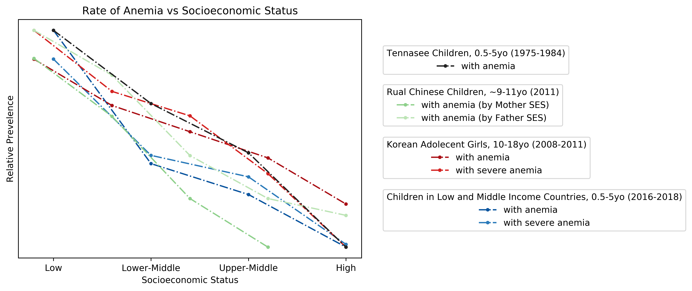
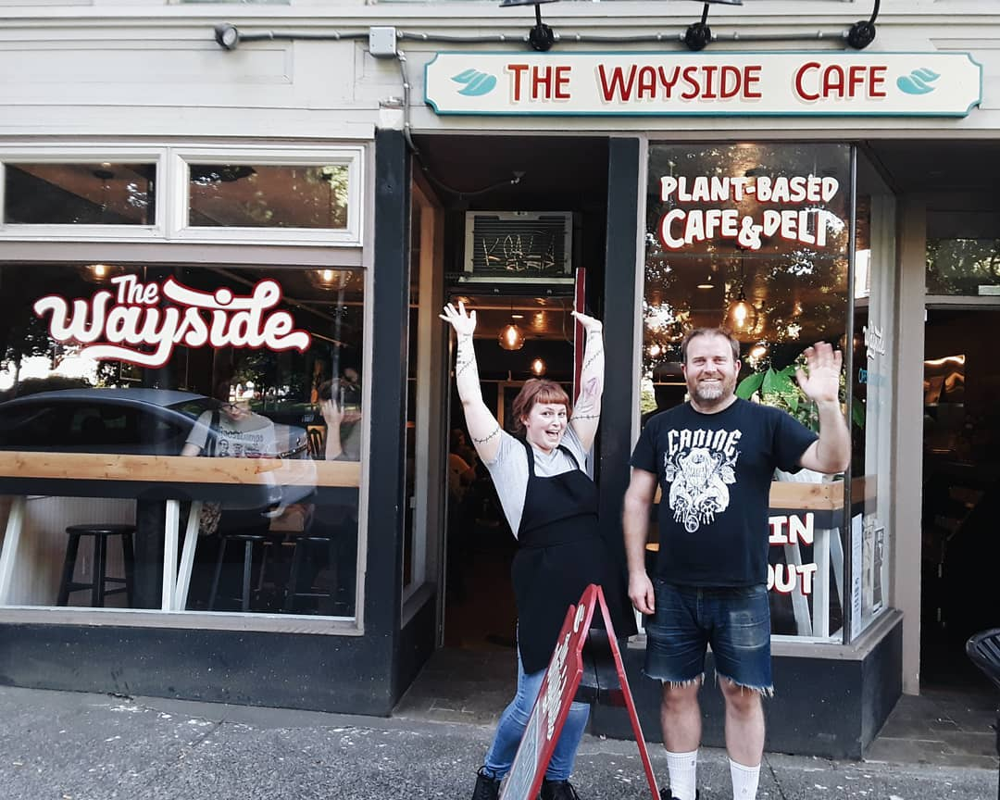
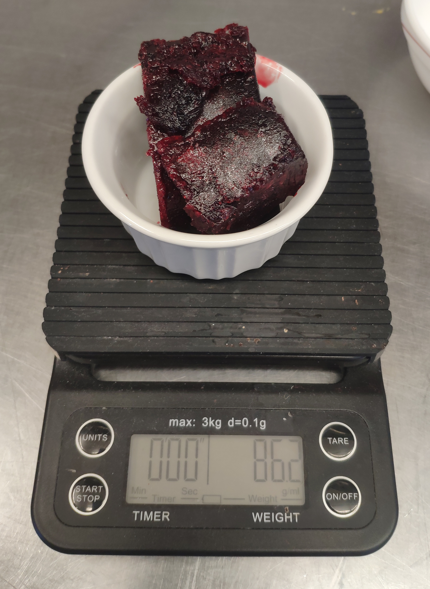
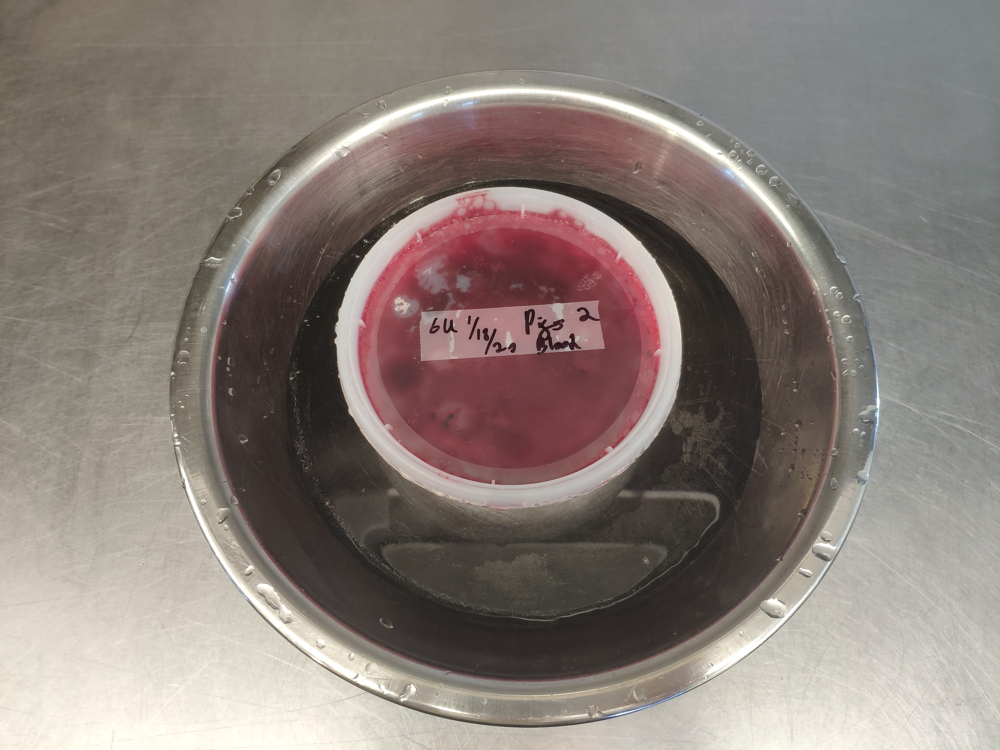
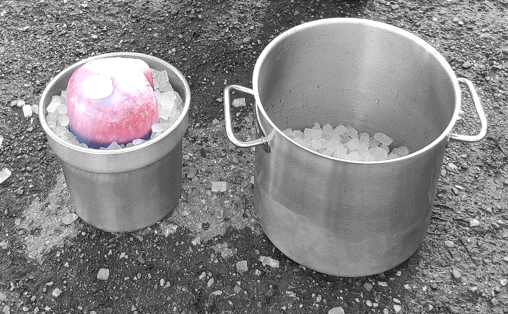
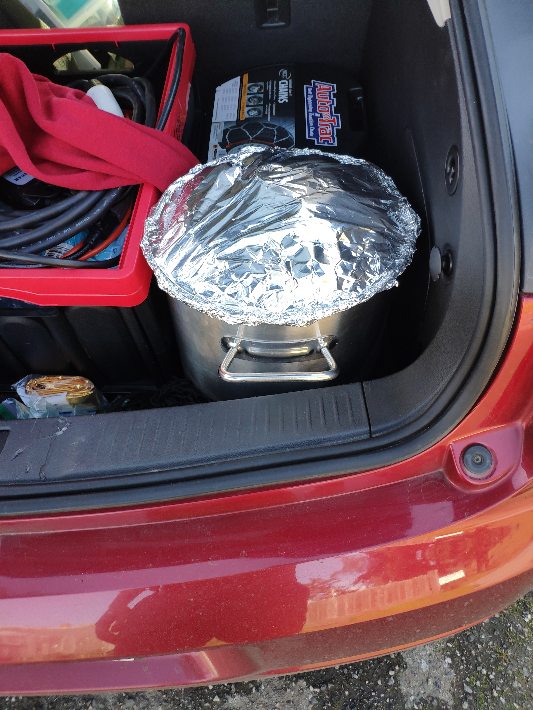
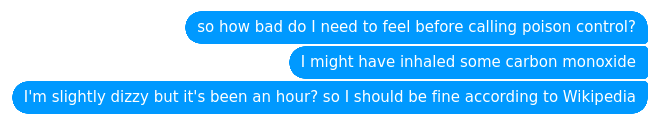
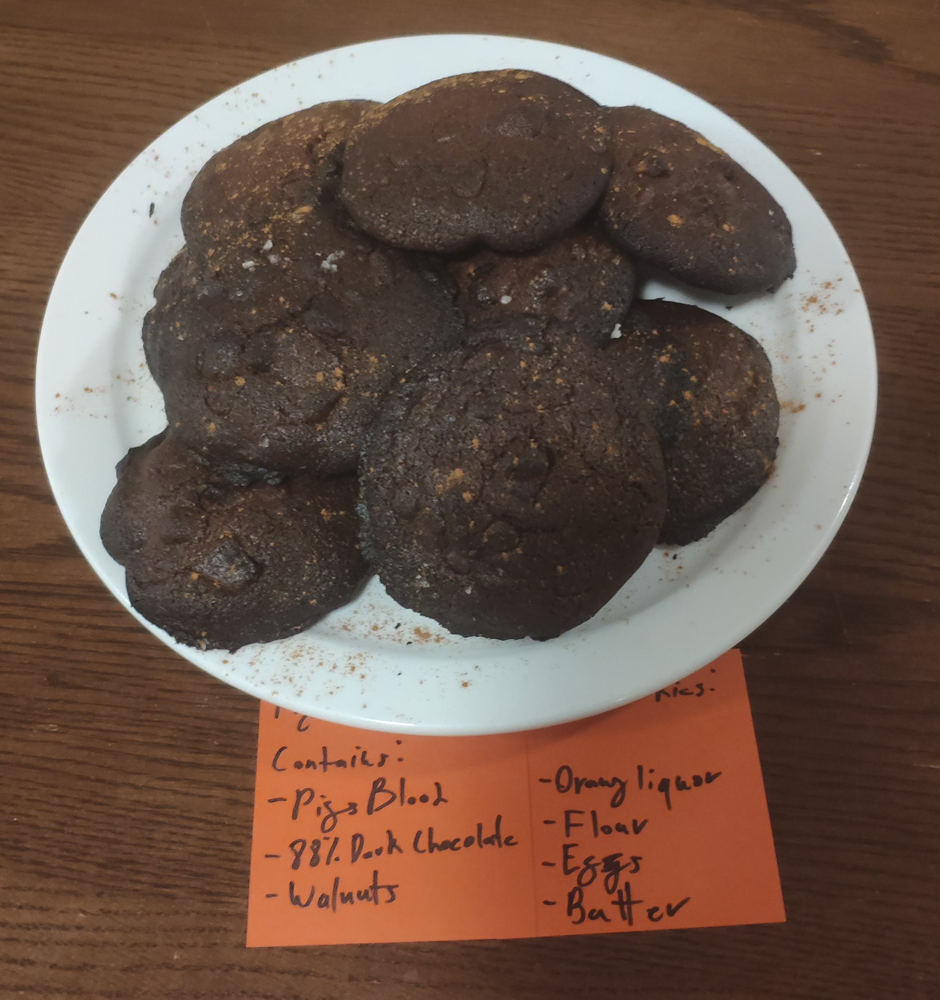
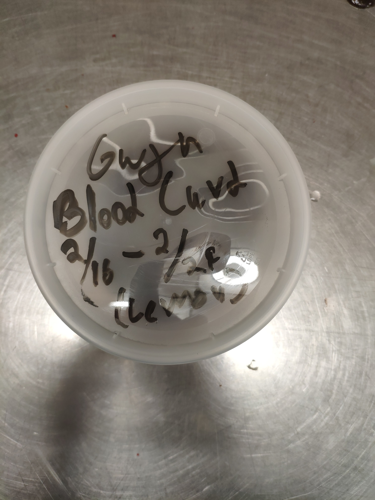
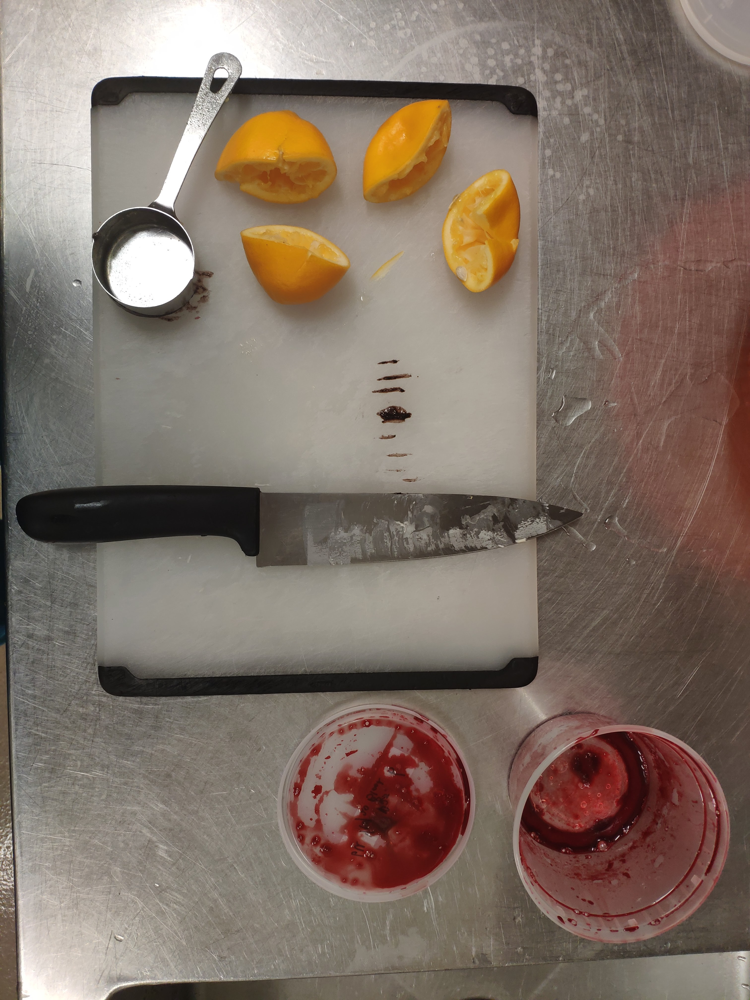

# Baking with Blood
<!--The Blood Bible: A Vampires Guide to Anemia-->

<!--
running notes:

Failing that, Browning says that some vampires will make a concoction with tea and herbs, which apparently also helps preserve the blood for longer.

throwing_olives
8 points
·
1 year ago
/u/FloppyKitties asked:

How does diet affect the flavor, from your experience? Do you have a preference for certain people's blood over others? Sorry, I'm so fascinated.

Just generally healthy and well hydrated is great. Fruit makes the blood sweet. Poor diet might make the blood overly salty, and if they've eaten recently, it might be a bit fattier. I've only ever tasted one guy who has really weird and bad tasting blood, but he smokes a lot and his diet isn't overly unhealthy, just very strange. Like, he'd eat a whole head of broccoli dunked in sour cream. TMI warning: His cum tasted absolutely awful too, extremely bitter. I think he's just a weird outlier.

Honestly, the method of storage matters more to the flavour than who it's from and what they eat. Even bad blood is still pretty good. Aside from that one guy.

https://www.reddit.com/r/casualiama/comments/be518l/i_drink_blood_and_rmorbidquestions_wanted_me_to/

-->

[toc]

> The identity ‘vampire’ means little to nothing to us. However, when we are blood drinkers, the label is impossible to shake – [CJ](https://www.bbc.com/future/article/20151021-the-people-who-drink-human-blood)

## Introduction

In what started out as an attempt to replicate the [Sanguinaccio Dolce](https://www.youtube.com/watch?v=MgJY0jPspMw) depicted in the TV series [Hannibal](https://en.wikipedia.org/wiki/Hannibal_(TV_series)), I've learned a lot about cooking with blood and I've done my best to document that. New to me (and to most americans I've talked to) blood has been used in cooking forever. I write about anemia and iron consumption and how consuming blood-based baked goods might be a better idea that it may initally seem. In a moment of existential crisis, I thought about the ethics/justification for consuming blood which I also include here. I have also assembled a small collection of historical / traditional recipies that use blood. Finaly, I write about sourcing, storage and a botched carbon monoxide treatment.

## Sanguinaccio dolce

> "Sanguinaccio dolce. A classic Neapolitan dessert, with almond milk. Easy on the stomach. 
> Blood and chocolate. That should've been the subtitle of my book." - Hannibal, The Great Red Dragon [S03E08]

Sanguinnacio dolce is a simple dish, with only four key ingridients: milk, sugar, chocolate and blood. Unsurprisingly, blood is the hardest to aquire now-a-days. It needing to be cooked or frozen quickly after slaughter means that sanguinnacio dolce, a once popular Southern Italian signature dish is now restricted to those with easy access to livestock.

After calling a number of famers, I [managed to aquire](#sourcing) roughly half of a gallon of fresh pigs blood. Starting with a recipie from [Emiko Davies](http://www.emikodavies.com/blog/blood-chocolate-sanguinaccio/), I gave sanguinnacio dolce my first shot. 

It was, I must say, not good. The final result was slightly grainy and had a very iron heavy flavour profile. Working with the blood brought up feelings similar to the first time I cooked with meat, definitly a high "eww" factor.

Working with the blood more eliminated the quisiness and adjusting the ingridient ratios fixed the flavour profile. The texture was fixed by changing the order of ingridiant addition (milk & chocolate first until melted, *then* add the blood). All in all, I had a wonderful dessert, a lot of blood and a ever increasing interest in incorporating blood into food.

## Recipes

!!!include(./src/creating/food/recipes/blood-crepes.md)!!!

!!!include(./src/creating/food/recipes/blood-banana-bread.md)!!!

!!!include(./src/creating/food/recipes/sanguinaccio-dolce.md)!!!

In the works:

- Blood Pancakes
- Blood Gelato
- Blood Pasta
- Blood Caramel

<!--
### Melas Zomos

Origin: Ancient Sparta, 
Blood form: 

Source(s):
-->

## Ethics of Blood Consumption

>Iron deficiency affects more people than any other condition, constituting a public health condition of epidemic proportions. More subtle in its manifestations than, for example, protein-energy malnutrition, iron deficiency exacts its heaviest overall toll in terms of ill-health, premature death and lost earnings.[^who-iron]

Iron deficiency anemia is the most common nutritional deficiency in the world[^who-iron] and the heme-iron form of iron (which is found in meats, organs and blood) is the most bio-available natural^[Aside from breast milk and dirt] iron source available. Iron deficiency anemia rates are not equal across demographics - women are by far the most affected, but infants and children are also heavily affected. Today, more than 1.6 billion suffer from anemia^[https://www.who.int/vmnis/anaemia/prevalence/summary/anaemia_data_status_t2/en/], mostly due iron deficiencies^[??]. Even in the US, iron deficiency anemia isn't uncommon^[https://ods.od.nih.gov/factsheets/Iron-HealthProfessional/]. Almost 47% of preschool-age children have anemia, and anemia contributes to 20% of all maternal deaths[^who-iron]. 

Put simply, it's a *big* problem. If you're female (or estrogen haver), there's a large chance^[how large?] you've either been anemic or *will* be anemic.

> "I was woken up when my body hit the floor. My first thought was 'Sophia, why did you lie down on the bathroom floor? You're in your pajamas.'" - My anemic friend, Sophia

Luckily, the solution is seemingly simple. The World Health Organization (WHO) breaks their strategy to reduce world wide anemia rates into a three part plan[^who-iron]:

1. Increase iron intake
2. Control infection^[Meaning Immunization and control programs for malaria, hookworm and schistosomiasis. In many developing countries, iron deficiency anaemia is aggravated by worm infections, malaria and other infectious diseases such as HIV and tuberculosis.[^who-iron]]
3. Improve nutritional status

To accomplish these goals, the WHO has developed a  "comprehensive package of public health measures." However, while we wait for large scale change, billions of people have an immediate need to improve their situation.

Adding blood to your diet accomplishes the first and most important components of the WHOs plan to beat anemia. If you don't have access to fortified cereals or supplements^[I don't want to encourage anyone to not seek out these arguably better methods of intaking iron. That said, if you need iron supplementation and aren't getting it through fortified foods or supplements because of availability or associated gastrointestional issues, blood represents an alternative method of increasing iron intake. Find what works for you, but find it.], the simple addition of blood to a meal can make sure you intake enough iron. 

But where does one get blood to cook with in the first place?

> Of all [slaughter house] waste products, the waste in the form of blood has the highest polluting value. Blood itself has a high BOD: 150,000 - 200,000 mg/l, the extreme value being 405,000 mg/l. (Domestic wastewater has a BOD of 300 mg/l). In the killing, bleeding and skinning phases, **blood is produced which, when completely sewered, leads to a total waste load of 10 kg BOD per ton of LWK. A waste load of up to 3.0 kg BOD per ton of LWK may occur in wastewater flowing out of the killing-area and the hide-removal-area.** ([source](www.fao.org/3/x6114e/x6114e04.htm#b12-2.3.2.1.%20Wastewater%20by%20red%20meat%20slaughtering))

Many slaughter houses have so much excess blood that, even after selling what they can for fertilizer/pig feed/other uses, they still dump tonnes down the drain. Butchers do much of the same^[source?], but seem more willing to sell blood to customers if they ask^[source?]. In my case, I simply had to ask and I got blood for free in a win-win situation: I got blood and they got the blood off their hands. (see [Sourcing Blood](#sourcing-blood) for details).

In this light, adding blood into your cooking repertoire is a classic ecofeminist move^[If, say, we started to consume *so* much blood that animals were being killed just to produce it *then* that would be a problem. I don't think we're going to get there any time soon], - it empowers women to improve their own health through accessible and ecofriendly action. And on top of that, if you're able to get your blood for free, you're not supporting the killing of the animal, only making sure that everything produced gets used.

Blood consumption where an animal wasn't killed toes the ethical boundaries developed by Ethical Vegetarianism/Veganism. As long as you're not contributing to the killing animals and simply diverting blood from a environmentally taxing disposal pathway, you're in the green.

Blood consumption may also help address some commonly cited problems with vegetarianism/veganism, namely inaccessibility (eg. the high price of plant based diets in some parts of the world). Veganism in the United States^[This is not the case in France (at least according to the numbers) nor in places where vegetarianism is considered the norm.] is often considered a thing of privilege, especially along lines of socioeconomic status, race/ethnicity and education. Further compounding issues of privilege, anemia rates are *heavily* correlated with socioeconomic status, at least in children (even when you control for red meat consumption, BMI, Age etc.):

Rate of Child Anemia vs Socioeconomic Status in Tennessee, Rural China, Korea and various Low and Middle Income Countries ([how I made this figure](./blood/data/Anemia-Rate-Figure-Generation.html))

Similar trends (as one might predict) can be seen across educational and racial gradients (not shown here).

> Your health and my health are reflexive of one another, and their health hangs in this balance. (PMS Vol1)

Until a vegetarian/vegan diet is _attainable_ and doesn't put you at _risk_ of anemia I proffer vegetarianism+ and veganism+ where the plus represents blood consumption as practical and more ecofriendly alternative.

I don't expect everyone will call multiple farms and ask for blood (see my notes on sourcing below) - that would be like suggesting yoga to a depressed person^[If you can get your blood from a farmer, that's *almost certainly* the right move. Sourcing locally means better quality and less ecological impact.]. However, if you've got a local butcher: ask them if they can save you some blood! Make a dish! Fight back by fighting anemia, channel your inner vampire. Killing animals is probably unethical. Eating blood doesn't have to be.

### Jamie Vulva

Jamie Vulva made cookies with her menstrual blood. They were "too floury" for her taste, thus she never made them again. However, the picture she posted on her tumblr, for lack of a better descriptor, blew up on the Internet. Often it can be found in a post trying to "prove" feminists crazy.

<!--In all fairness, Jamie Vulvas tumblr is pretty provocative. Suffice it to say the title of her blog is "Little girl, big pig" and she self describes as a "walking trigger warning". However t-->The discrepancy in the reaction of the internet to her menstrual blood jar (a jar in which she puts her vaginal discharge) verses that to her cooking with mentrual blood is interesting. Why is it that cooking blood is that much worse than, say, painting with it? Is it the act of consumption? Does the problem lie in that is menstrual blood, and that cooking with "normal" blood is perfectly permissible? Even though the original "I made menstrual blood cookies!" post was made in 2011 and I've yet to find anything similar.

Jamie Vulva now runs a vegan restaurant in Olympia, Washington! I'm curious both about her cooking with menstrual blood and how she handled the unwanted Internet attention. <!--> and I've reached out to her because I'm curious both about her cooking with menstrual blood and how she handled the unwanted Internet attention. She's yet to respond.-->

## Assorted Notes

### Handling

### Cook Time
It's often hard to know when things are done, as the blood turns a deep brown when heated. This means that perfectly-done cookies and overdone cookies look *very* similar:

On the right the cookies are underdone, but on the left they're overdone, edging on burnt. The easy way to fix this is trust your timer - when it beeps, take them out!

### Freezing and Defrosting

### Removing Clots

Some sources^[sources?] recommend blending your blood after it's defrosted to, at least I assume, prevent any clots from making their way into the final product. I find that straining the blood is much more convenient, and allows me to strain directly into a weighing dish as not to waste blood in the blender. It also has the upside of not needing to clean a blender.

### Portioning

Instead of freezing large batches, I recommend freezing in ice cube trays - measuring out so each blood cube (aka a *blube*) is 43g (one egg white equivalent). Three cubes (129g) are two egg equivalents which makes for easy portioning.

### Microwaving

I, being someone who often cooks on a whim instead of a plan, often want to speed up the defrosting process. All my attempts to microwave defrost blood have resulted in at least some charring. (And believe me when I say you *don't* want to know what burnt blood a la microwave smells like.) Ultimately, I've found a warm bowl of water to most effective.

### Anticoagulents: Salt and Vinegar

### Sourcing

My process of obtaining the original 7 liters of pigs blood was, at the very least, not streamlined. I called 15+ increasingly distant places that sold specialty meat or did their own butchering. I eventually found a very kind farmer that was willing to help - in the end he asked a client he was butchering for if it was okay if he saved the blood for me. (I've left his name out for privacy/legal reasons.) However, other people seem to have had better luck than me in finding someone willing to sell them blood, so your mileage may vary.

### Carbon Monoxide: Maintaining that Boyish Pink

Inspired by [this thread](TODO) prepared carbon monoxide^[via the dehydration of formic acid with concentrated sulfuric acid, a similar setup can be seen [in this youtube video](https://www.youtube.com/watch?v=E1ujbhBDpKs)] and bubbled the gas through some blood. 

From left to right I have: the reaction producing carbon monoxide, a cold trap and finnaly the blood. In the bottom right hand corner, there is a small scintilation vial with blood in it that I purged with {N2|chem} and then flowed carbon monoxide through. The glassware available to me at this point was minimal due to SARS-CoV-2 induce lab closures and so I was using the cold trap instead of a more suitable substitute. The cold trap was nessesary as the carbon monoxide produced was hot enough to cook the blood on contact. When stopping this reaction I was quite tired (it was well past midnight) and I removed the reaction flask from the heat without venting the system to atmosphere. This caused a vacuum and ended up pulling water from the cold trap (which was there to dissolve any excess sulphuric/formic acid vapour given off by the reaction) up and into the reaction flask. The water quickly boiled and blew the stopper off of the flask thus releasing enough carbon monoxide into the fume hood that I was worried for my safety. 

My symptoms for the next 24 hours lead me to belive that I was only in the [200-400ppm zone](https://en.wikipedia.org/wiki/Carbon_monoxide_poisoning#Acute_poisoning). I am thankful that I was not working alone, and my lab partner helped me clean up and put things away. I walked home and had difficulties deciding whether or not to take my nightly medications (which should have been a no brainer: don't, they lower blood pressure). The next morning I woke up hazy and gave a very hazy presentation about pink capitalism in the gender neutral clothing industry and continued on with life without further complications.

Take away: don't work very late at night, and if you do make sure you have the right setup with extra stages to prevent backflow accidents.

Sadly, due to SARS-CoV-2, this lab space was shut down the next day and I was unable to retrieve my samples. All that for naught as the carbon monoxide treated samples were not distinguishable by eye.

## Recipes (Failures)

#### Blood Molasses Cookies

#### Lemon Blood Curd (2/16/20)

#### Blood Merange

## Historical Recipes

<!--
# Draft Content

(everything below this is a DRAFT)

## But does it Taste Good?

In short, yes. For many of the recipies people couldn't tell they were eating blood. Even when I told them their was a "weird" ingridient, no one has sucessfully guessed blood yet.

That said, too much blood is *not* a good thing. Especially in baked goods. There was definitely a learning curve to figuring out how much blood each dish could "handle."

> I feel like this bread would taste good if I made bread with way too much blood and then I made this. It would definitely be better than the bread with way too much blood! [Mei-lan]

### The Gross Factor

> "these taste experiments in the field made us reflect on how crucial it is to not forget about all the “normal people” out there. Whether it’s about them having different tastes or a less-strong attraction to the new and unusual compared to the people in our immediate surroundings is a big question worth thinking about. What is usual here at the Lab is often weird and disgusting for many folks out there. Doing what we do is exciting and fun, at times both dippy and inspiring – but if we fail to reach out and convince others unlike us to at least give some of these foods a try, what is the point in the long run?" - [A side of bee larva with your afternoon coffee?](https://web.archive.org/web/20200419022305/http://nordicfoodlab.org/blog/2014/2/a-side-of-bee-larva-with-your-afternoon-coffee) by Edith Salminen at Nordic Food Labs

Similar to the first few times I handled raw meat, my initial encountors working with blood were slightly nauseating. That feeling quickly faded, but elephant in the room can't be ignored. The Gross Factor(tm) is definitely something that was on the mind of many of my recipie and taste testers.

> "I was really expecting to be grossed out, but then it was... fine. I thought it'd be thick but it wasn't. It was just like cooking with wine" - Alex, a recipe tester

I've been banned from talking about blood at home.

> "Cooking with blood is probably the least kosher activity in existence" - Ash

Blood. It's in meat, many people eat it all the time. And yet, for many the thought of eating something where blood upstages meat triggers a visceral discussed response. I tackle this problem continually in the recipes above, many of the ingredients and techniques are employed in an attempt to downplay or soft and the taste of blood. Why is this so? Why do we not like blood?

## Legality of Blood Consumption
https://www.law.cornell.edu/cfr/text/9/310.20

### Iron

#### How much do you need?

>The U.S. Food and Drug Administration (FDA) developed DVs to help consumers compare the nutrient contents of products within the context of a total diet. The **DV for iron is 18 mg for adults and children age 4 years and older**. FDA requires food labels to list iron content. Foods providing 20% or more of the DV are considered to be high sources of a nutrient, but foods providing lower percentages of the DV also contribute to a healthful diet.

|Age|Male|Female|Pregnancy|Lactation|
|------|-------|--------|--------------|-----------|
|Birth to 6 months|	0.27 mg*|	0.27 mg*		|
|7–12 months	|11 mg|	11 mg		|
|1–3 years	    |7 mg	|7 mg	|	
|4–8 years	    |10 mg	|10 mg	|	
|9–13 years	|8 mg	|8 mg	|	
|14–18 years	|11 mg	|15 mg	|27 mg	|10 mg
|19–50 years	|8 mg	|18 mg	|27 mg	|9 mg
|51+ years	|8 mg	|8 mg	|	
Table 1: Recommended Dietary Allowances (RDAs) for Iron ($*$Adequate Intake (AI))

#### How much is too much?

> Ingestion of less than 20 mg/kg of elemental iron is non-toxic. Ingestion of 20 mg/kg to 60 mg/kg results in moderate symptoms. Ingestion of more than 60 mg/kg can result in severe toxicity and lead to severe morbidity and mortality.^[Yuen HW, Becker W. Iron Toxicity. [Updated 2019 Oct 30]. In: StatPearls [Internet]. Treasure Island (FL): StatPearls Publishing; 2020 Jan-. Available from: https://www.ncbi.nlm.nih.gov/books/NBK459224/]

Even as a 4 year old AMAB^[Assigned Male at Birth] child (16kg)^[https://www.cdc.gov/growthcharts/data/set1clinical/cj41l021.pdf] taking two iron supplements a day (2x33mg, which is already *way* too much), you'd need to eat 3 1/2 loaves of bread, 1 1/2 *batches* of sanguinnacio dulce, or 50 crepes to get to the toxic realm. I think you'll be fine but don't push it, okay?

To get the equivalent of an Iron only supplement (360% of the reccomended daily intake), you'd need to eat *alot* of the food described here. Think of these recipies as a way prevent anemia rather than a way to come back from it. ""An ounce of prevention is worth a pound of cure" really resonates here. The hope is that these recipies are a fun and easy way to bump up your iron intake, avoid the need for supplements and reduce iron supplement associated gastrointestional issues^[Iron-only supplements usually deliver more than the DV, with many providing 65 mg iron (360% of the DV). Frequently used forms of iron in supplements include ferrous and ferric iron salts, such as ferrous sulfate, ferrous gluconate, ferric citrate, and ferric sulfate. Because of its higher solubility, ferrous iron in dietary supplements is more bioavailable than ferric iron. High doses of supplemental iron (45 mg/day or more) may cause gastrointestinal side effects, such as nausea and constipation. Other forms of supplemental iron, such as heme iron polypeptides, carbonyl iron, iron amino-acid chelates, and polysaccharide-iron complexes, might have fewer gastrointestinal side effects than ferrous or ferric salts.^[https://ods.od.nih.gov/factsheets/Iron-%20HealthProfessional/#en28]]
#### Absorption
Some foods promote the absorption of iron, some prevent it. Here's a list!

[list]

### Blood
-->

[^nordic-food-lab]: [Blood and egg](http://nordicfoodlab.org/blog/2013/9/blood-and-egg?rq=blood%20pancake) by the [Nordic Food Lab](http://nordicfoodlab.org/whoweare)

[^DV]: Daily Value as defined by the FDA. Not the best metric as needs vary person-to-person, see [How much do you need?](#how-much-do-you-need) for more details.
[^who-iron]: https://www.who.int/nutrition/topics/ida/en/
