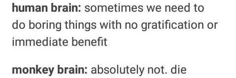
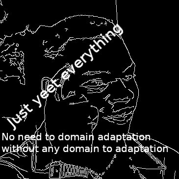
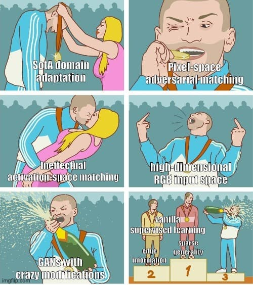
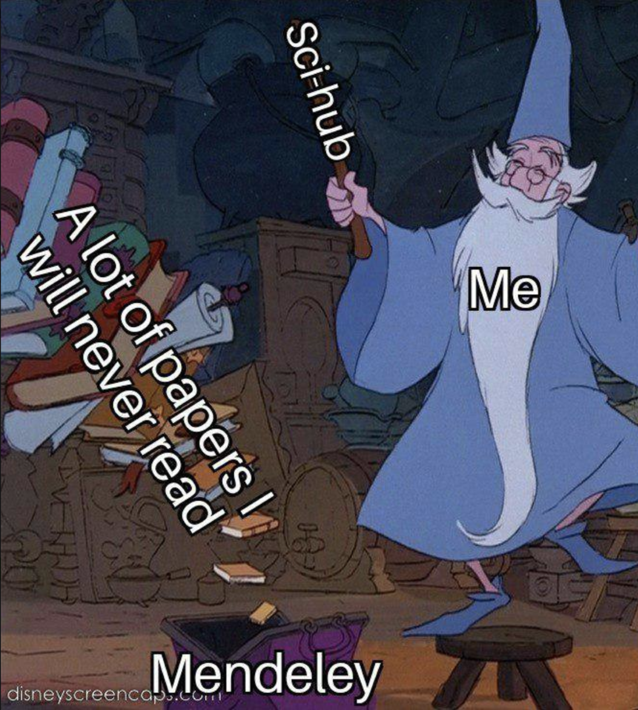
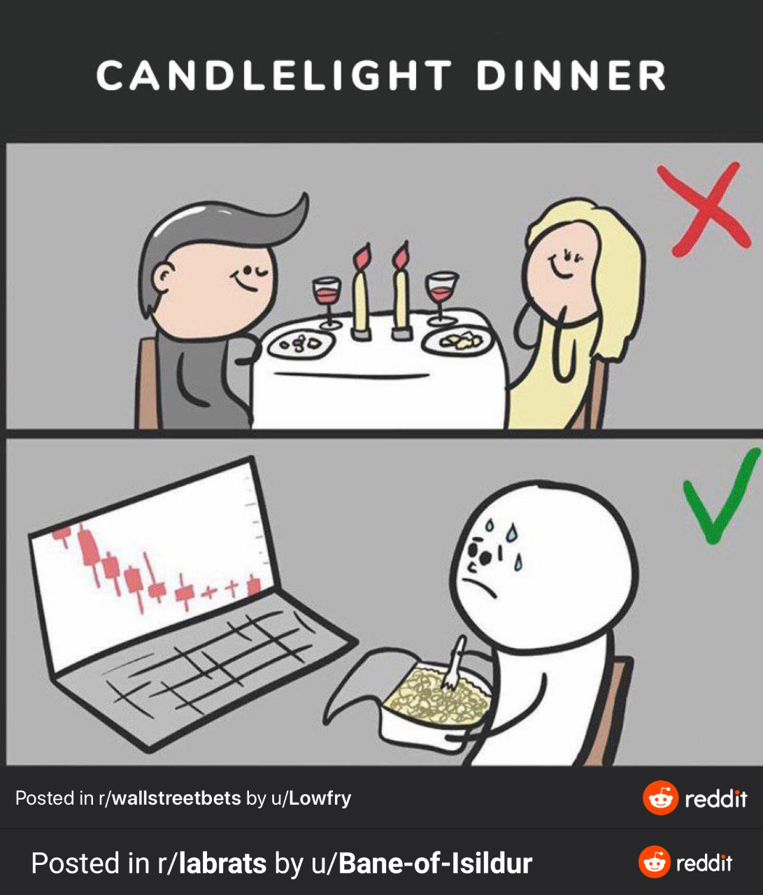
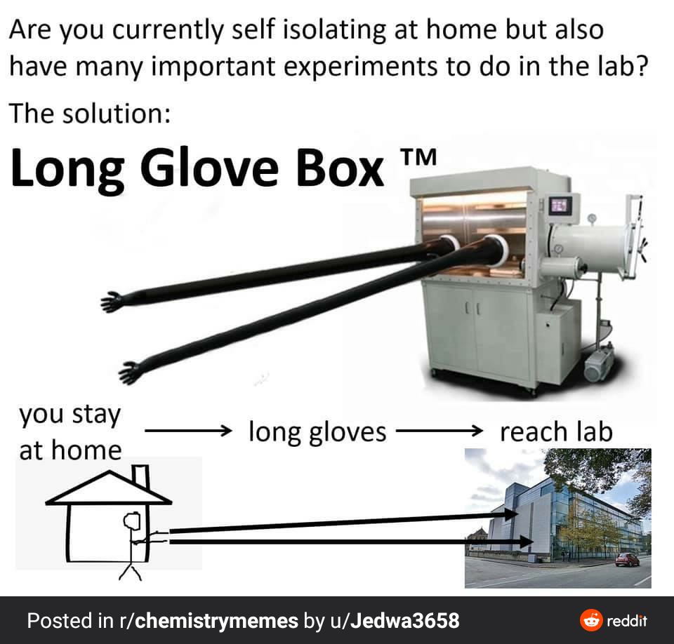
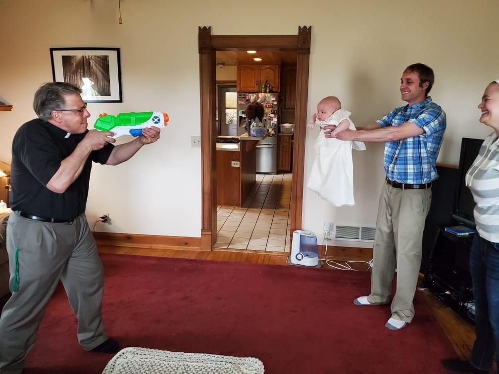
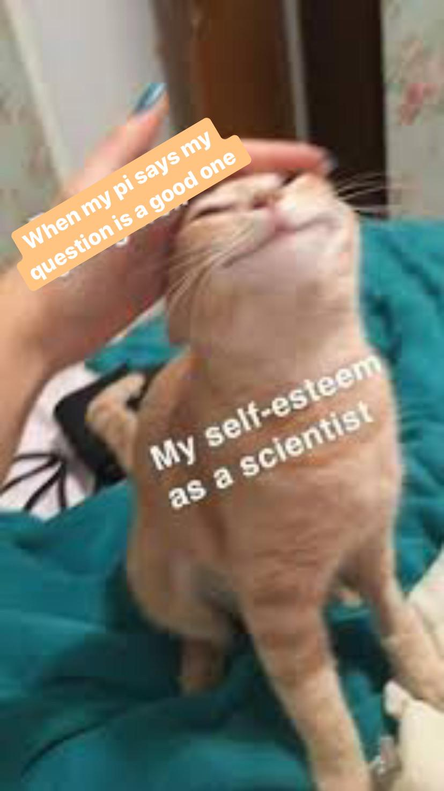
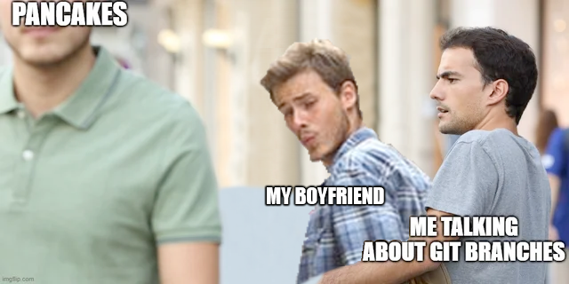

# Presenting: presenting.

Anarchist scientific support collective? 

idk, we host presentations about personally motivated projects and offer constructive feedback, call it what you will.

Recurring zoom meeting at [stanford.zoom.us/j/99935696308](https://stanford.zoom.us/j/99935696308).

Next meeting: Monday April 26th 2020, 18:00PDT.

Table of archived content:

[toc]

### Initial Contact: Email 1 (Sent 13:23PDT 4/23/2020)

<!-- EMAIL 1 -->

<i>HELLO</i>

<i> 
</i>

:wave:it's been a while:wave:

 

rn I'm like:

 

 

'tis hard to stay motivated with a global quarantine goin' on

 

 
👩‍🔬 :gun: :school: 
 

usually school // my PI // my team-mates hold me accountable through:

<ul style="font-family:Calibri,Arial,Helvetica,sans-serif">
<li>peer pressure&nbsp; 
</li><li><a href="https://www.youtube.com/watch?v=F0kCYP_iPtg" title="https://www.youtube.com/watch?v=F0kCYP_iPtg" target="_blank">(this is your brain on science, just
say no!)</a></li><li>presentations that I forgot I signed up for
<a href="https://www.youtube.com/watch?v=_lebt-10Tq8" title="https://www.youtube.com/watch?v=_lebt-10Tq8" target="_blank"> 
(where I just wing it but it turns out better than when I prepare)</a> 
</li><li>regular check ins 
<a href="https://www.youtube.com/watch?v=ovEghdXC4tE" title="https://www.youtube.com/watch?v=ovEghdXC4tE" target="_blank" >(so I feel like I gotta get somethin' done) 
</a></li></ul>

 

soooooooo, 

in a "be the change you wanna see in the world" kinda vein

 

~~&nbsp; &nbsp;Presenting: presenting.&nbsp; &nbsp;~~

 

Every Monday,&nbsp;

we'll have someone present on their project&nbsp;

(sciency, artsy: we'll have it all)

(everything (and I mean
<i>everything</i>) is
welcome!)&nbsp;

🔥and then we'll grill 'em🔥

(aka just
provide&nbsp;nice and useful feedback)

 

oh, and did I mention there's going to be a
<b><u>1 meme quota</u></b> for each presentation?&nbsp;

yeah. that's a thing.

 

After the presentation,&nbsp;you'll be&nbsp;

<b style="font-family:inherit;font-size:22pt;font-style:inherit;font-variant-ligatures:inherit;font-variant-caps:inherit">matched with someone</b>

in a zoom breakout room to do&nbsp;

a mini-update on your project

 

 

THIS MONDAY

MICHAEL ARCIDIACONO &amp; JACK [SRY I DON'T KNO UR LAST NAME]

PRESENT

AI CLOTHING SIZING 

<a href="https://stanford.zoom.us/j/99935696308" style="color:rgb(14,113,235);background-color:rgb(255,255,255)" target="_blank">

 

</a>

<a href="https://stanford.zoom.us/j/99935696308" style="box-sizing:border-box;background:rgb(255,255,255);font-size:16px;color:rgb(14,113,235)" target="_blank">zoom link</a> 

(don't
worry if you don't understand these memes,,,, I sure don't)

<a href="https://stanford.zoom.us/j/99935696308" style="box-sizing:border-box;background:rgb(255,255,255);font-size:16px;color:rgb(14,113,235)" target="_blank" >zoom link</a>

 

<a href="http://www.thetimezoneconverter.com/?t=6pm&tz=PDT%20(Pacific%20Daylight%20Time)" title="www.thetimezoneconverter.com/?t=6pm&amp;tz=PDT (Pacific Daylight Time)" target="_blank">6PM
PDT ;; 7PM MDT ;; 8PM CDT ;; 9PM EDT</a>

BE THERE OR MISS OUT

 

🙂but also come only when you can - you don't need to make them all🙂

 

 

k, thanks for reading that all! lookin' forward to seeing y'all🤗

 

 

enjoy these memes!
 

<!-- END OF EMAIL1 -->

