# DIY HRT

[toc]


> "A grey or gray market (sometimes confused with the similar term "parallel market") refers to the trade of a commodity through distribution channels that are not authorized by the original manufacturer or trade mark proprietor. Grey market products (grey goods) are products traded outside the authorized manufacturer's channel." [Wikipedia](https://en.wikipedia.org/wiki/Grey_market)


## SARS-CoV-2 Era Work (March 2020 - December 2020)

Having relocated, lost BIOME funding and access to a GCMS or a wet-lab my options for continuing work dramatically changed. I made the decision to focus on creating *cheap* and *user-friendly* drug tests for the hormones commonly used in DIY HRT.

My plan is to synthesize gold nanoparticles, and then use dna aptamers to modulate their aggregation to produce a color change upon introduction of Estradiol/Testosterone.


### Initial Validation (March-July 2020)
#### Aptamer Based Colorimetric Sensing

On 05/16/2020, I ordered 100nmols of the 35nt aptamer from [this paper on estradiol aptamers][Alsager 2015] which I call Alsa1535. It arrived 05/22/2020.

```nucleic
Alsa1535: 5'- AAG GGA TGC CGT TTG GGC CCA AGT TCG GCA TAG TG -3'
```

On 05/27/2020, I was able to confirm that Alsa1535 binds to estradiol valerate and not just estradiol with impressive linearity (R^2^=0.9975):

](./estradiol/05272020-e2-additions-curve.png)

](./estradiol/estradiolValerateTitrationLinearFit.png)

The results *cannot* be in any major part attributed to the absorption of estradiol valerate alone:

](./estradiol/estradiol-valerate-abs.png)

#### Gold Nanoparticle (AuNP) Synthesis [:musical_note:](https://open.spotify.com/track/1TWNKyNQOBfNUkWWs7FooF?si=Rv9AavwQQbiKFNgX93jZcQ)


My protocol is based on [this paper from Nature][Liu 2006] [and this paper from ACS][Alsager 2015] and necessarily excludes some steps (eg. pre-treatment of glassware with aqua regia) due to the limitations of working out of my baby brothers room. It, and my revisions can be found [in this github repository].

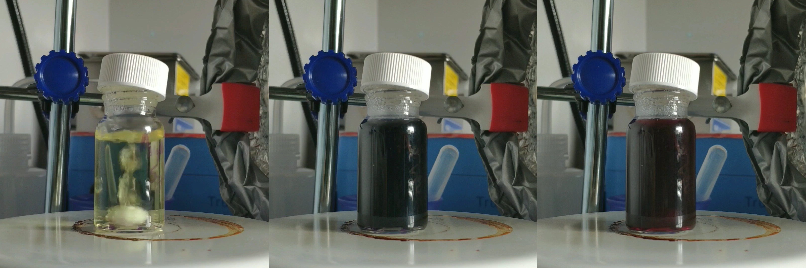

The resulting concentration comes out to be 9.8nM (calculation via the Beer-Lambert law). In calculating the concentration, I noticed an interesting absorption spectrum for the raw nanoparticles:

](./estradiol/rawAuNPwithandwithoutAptamer.png)

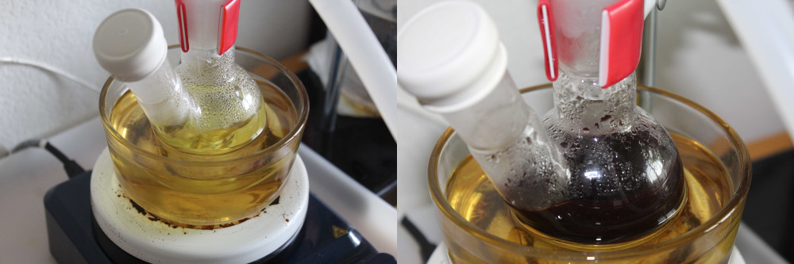

Attempts to scale up the synthesis were sucessful at 50mL and 100mL. However, the absorbance of said batches in the 600-750nm range is correlated with the reaction size. It's unclear if this is a bad thing, but it's likely due to differing particle sizes brought on by a slower dispersal of the Sodium Citrate upon addition.

](./estradiol/interns/figs/aunps.png)

### Interns! (July-October 2020)

Through a BIOME mailing lists, I had two folks join the team. They were wonderful and taught me a lot.

#### Arthur Liang


Arthur worked on designing new testosterone aptamers for an AuNP assay. He also identified the most promising already extant testosterone aptamers. Unfortunately, we canot evaluate these aptamers until we have access to testosterone again - a feat complicated by it's scheduled status.

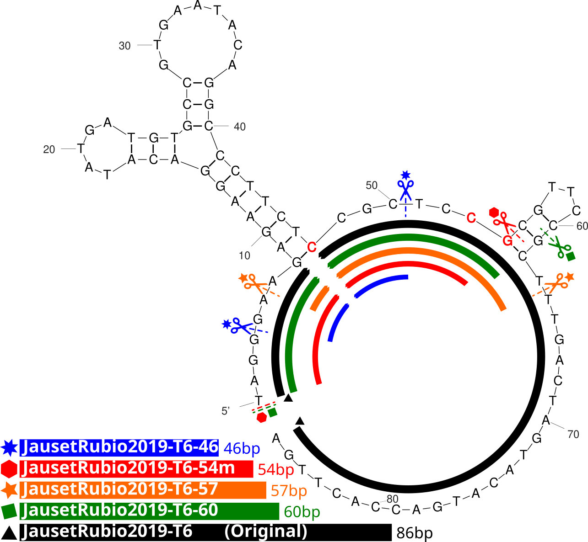

See Sonja and Arthur's preliminary write up for all the details: [sonya-ahuja-paper.gwynu.dev](http://sonya-ahuja-paper.gwynu.dev/)

#### Sonya Ahuja 

![Sonya is (at the time of writing) a senior at Evergreen Valley High School in San Jose, CA.  She serves as the Regional Director of Youth Movement Against Alzheimer’s (YMAA) and raises awareness for Alzheimer’s and Dementia nationally. She plans to major in Neuroscience or Global Health while advancing Alzheimer’s research to help discover treatments and cures for the disease during her college years. While medicine is her primary interest, she also loves interacting with and learning about diverse cultures-- especially through food.  As an aspiring neurologist, establishing equity in treatments and healthcare is a goal of hers. Gender equality is another cause she is devoted to as president of Girl Up at her high school, and she hopes to continue empowering her community to help underprivileged women.](./estradiol/interns/sonya.jpg)

Sonya worked on identifying progesterone aptamers in existing literature. She identified PG13T1 and PG13T2 from [Alhadrami 2017](http://doi.org/10.1016/j.ab.2017.02.014) as promising candidates. Unfortunately the experimental results *suggested* that they had good binding and selectivity but were ultimately inconclusive.

](./estradiol/interns/figs/final-fig.png)

See her and Arthur's preliminary write up for all the details: [sonya-ahuja-paper.gwynu.dev](http://sonya-ahuja-paper.gwynu.dev/)

#### Aptamer Tables

| Aptamer                    | Length | Sequence|
|---------|----|----------------------------------------|
| Alhadrami2017&#8209;PG13       | 61nt   | GCA TCA CAC ACC GAT ACT CAC CCG CCT GAT TAA CAT TAG CCC ACC GCC CAC CCC CGC TGC |
| Alhadrami2017&#8209;PG13C4     | 11nt   | TGG GCG GTG GG                                                                                           |
| Alhadrami2017&#8209;PG13T1      | 31nt   | GCA TCA CAC ACC GAT ACT CAC CCG CCT GAT                                                                        |
| Alhadrami2017&#8209;PG13T2      | 26nt   | GAT TAA CAT TAG CCC ACC GCC CAC C                                                                             |
| JausetRubio2019&#8209;P5         | 101nt  | TAG GGA AGA GAA GGA CAT ATG ATA CCT CCG AAG TAT CAT GCG GAG CAT GTC CCG AAT TTC ATT CGT TCT CGT GAC TTG ACT AGT ACA TGA CCA CTT GAG G |
| JausetRubio2019&#8209;P6         | 89nt   | TAG GGA AGA GAA GGA CAT ATG ATA CCT CCG AAG TAT CAT GCG GAG CAT GTC CCG AAT TTC ATT CGT TCT CGT GAC TTG ACT AGT ACA TGA CCA CTT GAG G            |
| JausetRubio2019&#8209;T6&#8209;46      | 46nt   | GAA GAG AAG GAC ATA TGA TGT GCC GTG AAT ACA GGC CCT TCT CCG C |
| JausetRubio2019&#8209;T6&#8209;54m     | 54nt   | TAG GGA AGA GAA GGA CAT ATG ATG TGC CGT GAA TAC AGG CCC TTC TCT GCT CGT                                                |
| JausetRubio2019&#8209;T6&#8209;57      | 57nt   | AGA GAA GGA CAT ATG ATG TGC CGT GAA TAC AGG CCC TTC TCC GCT CCG CGT TCC GCT                                             |
| JausetRubio2019&#8209;T6&#8209;60      | 60nt   | TAG GGA AGA GAA GGA CAT ATG ATG TGC CGT GAA TAC AGG CCC TTC TCC GCT CCG CGT TCC |
| MiriamJauseTRubio2019&#8209;T6  | 86nt   |  TAG GGA AGA GAA GGA CAT ATG ATG TGC CGT GAA TAC AGG CCC TTC TCC GCT CCG CGT TCC GCT TTG ACT AGT ACA TGA CCA CTT GA     |
| Skouridou2017&#8209;T5     |    86nt    |   TAG GGA AGA GAA GGA CAT ATG ATT GC GTG GGT AGG AAG GGG CGG TGT GAT CTG AA TCG TTC GAT TGA CTA GTA CAT GAC CA CTT GA|


|Target     |Aptamer |Target Kd (nM)| T |P4| E2|
|--------------|--------------------------|----------------|-----|------|--------|
|Testosterone|JausetRubio2019-T6 |0.80 ± 0.18 |103 |1090| 4725|
||Skouridou2017-T5 |4.0 ± 5.8 |NR| NR |NR|
||Skouridou2017-T4 |1.2 ± 0.2 |NR |NR |NR|
||Skouridou2017-T3| 1.8 ± 0.6 |NR |NR |NR|
||Skouridou2017-T2 |33.2 ± 76.2 |NR |NR |NR|
|Progesterone|Alhadrami 2017-PG13T1| 2.1 |NR |NR |NR|
||Alhadrami 2017-PG13T2 |2.2 |NR |NR |NR|
||Alhadrami 2017- PG13| 35 |NR |NR |NR|
||Alhadrami 2017- PG13C4 |NR |NR |NR |NR|
||JausetRubio2019-P5 |2.03 ± 3.24 |1060 |112| 1373|
||JausetRubio2019-P6 |0.57 ± 0.84 |1096 |183| 432|

## BIOME Exploration (Summer 2019-Winter 2020)

> "BIOME is a student organization dedicated to providing open space for anyone interested in pursuing bioengineering and biology inspired projects." [BIOME](https://biome.bio).

After the initial quantification project, I applied for and received a project grant from [BIOME](https://biome.bio) for continued exploration. The original application timeline and budget are available [here](BIOME-GANTT-CHART-PROJECT-MILESTONES-06212019.xlsx). Like many projects the initial timeline was *far* too ambitious.

The funded goals were:

- Validation of UV-Vis as a cheaper alternative to GCMS
- A parallelizable / fast preparation protocol for tablets with varying coatings, sizes and shapes
- Validation and generation of a sub 15 minute GCMS procedure for general purpose quantitation of estradiol in samples


### Validation of UV-Vis

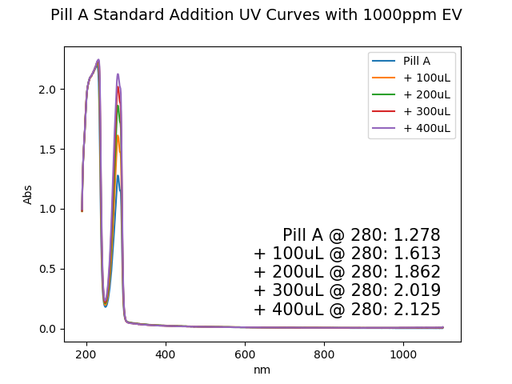

UV-Vis was more difficult to get consistent accurate results than previous experiments would suggest. On top of that, prepping UV-Vis samples was a hassle - there were so many steps, and each sample had to be run manually without batching.

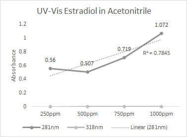

Eventually, I got consistently high R^2^ values (~0.93-0.97 range) but I kept getting strange nonlinear like responses that set me on edge. At this point, I set UV-Vis aside because there was a) a distinct lack of faith in my data, b) no way the procedures I was using would scale to 100s of samples and c) little hope for a frameshift change in the way samples would need to be prepped.

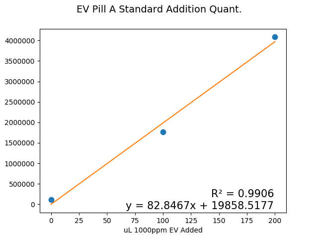

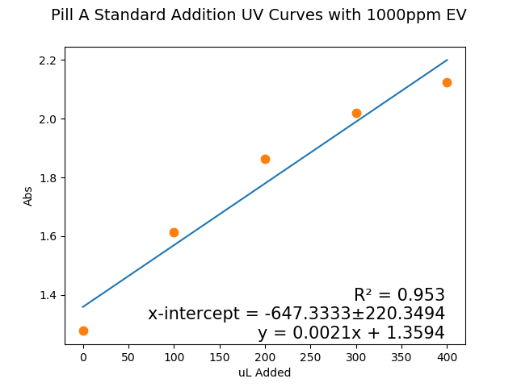

As time passed, I began to forget the pain of sample prep and again became curious about the source of the non-linearities of my data. Foreshadowing of times to come? Possibly.

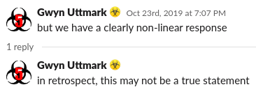

### Tablet Prep. Protocol

Tablet preparation is important. I quickly realized that, if I'm going to run 100s of samples, I can't use my original procedure of:

- Weight tablet
- Powder pill in mortar and pestle
- Weigh by transfer produced powder (~80% transfer is average)
- Wash and dry mortar and pestle

it simply was too time consuming and rife with potential human error. None of the preparation methods worked at fully dissolving all tablets - with sugar (sucrose) coated tablets being the hardiest of them all.

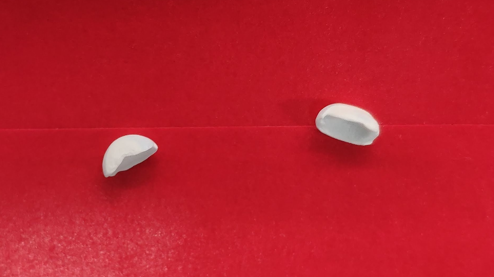

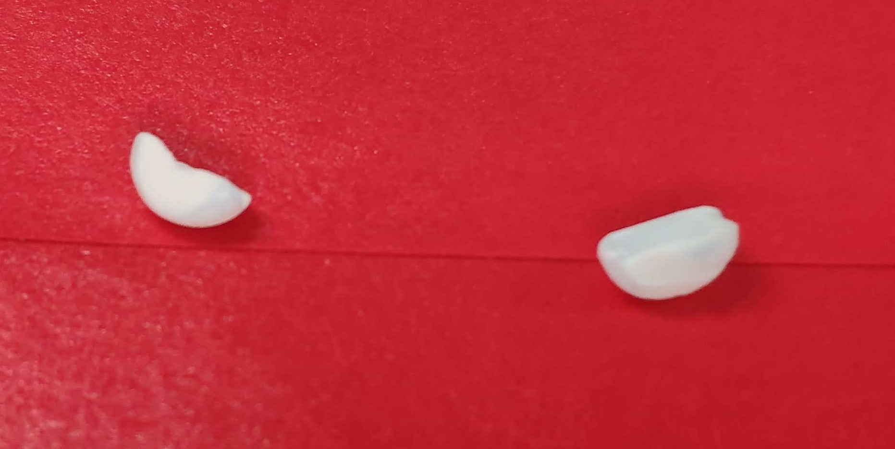

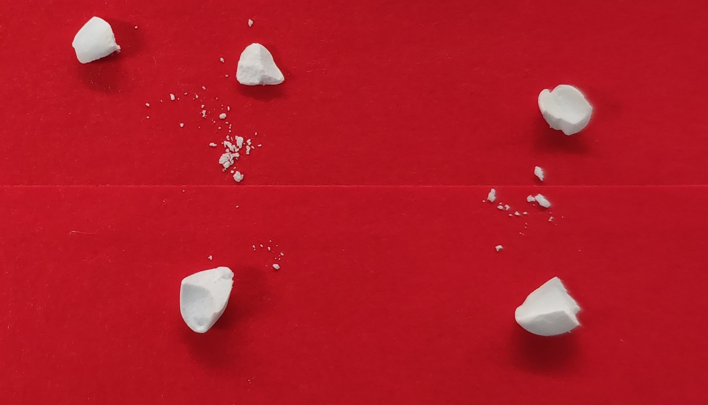


### GCMS Procedure Development

My lab notes:

[Silylation and Methanol as an Alternative GC Solvent](./estradiol/Silylation-and-Methanol-as-an-Alternative-GC-Solvent-(W2-Winter-2020-BIOME).pdf)

[Mixed Solvent Silylation & Further GCMS Method Development](./estradiol/Mixed-Solvent-Silylation-and-Further-GCMS-Method-Development-(Winter-2020-BIOME).pdf)

And [Various](./estradiol/10212020-Lab-Notes.pdf) [other](./estradiol/oct21-data.zip) [files](./estradiol/11092020-Lab-Notes.pdf) that are less organized and likely useless to anyone but me.


## Initial Quantification Project (Spring 2019)

In Spring of 2019 I was enrolled in an [Analytical Chemistry Laboratory](https://explorecourses.stanford.edu/search?view=catalog&q=CHEM+134+Analytical+Chemistry+Laboratory&academicYear=20142015) which had a project component (which was the best part of the class imo). I, along [Julia Tanzo](https://www.researchgate.net/profile/Julia_Tanzo) worked on developing a quick and versatile method of quantitation of Estradiol in grey market tablets.

Below is the content we presented at the end of the class. The original poster is also available as a pdf [poster](./estradiol/Chem-134-Final-Project_(uttmark-tanzo,2019).pdf).

***Warning:* I am unable to replicate the analysis presented in this poster. See [this page](./estradiol/CHEM-134-Validation.html) for details. In short, there is an off-by-ten discrepancy that I do not have an explanation for. My partner had the flu and we only had a week to create the method and collect data - please think carefully about making conclusions from these data.**

After completing this project, I found [this paper](https://doi.org/10.1590/S0100-40422010000400040) which also deals with UV quantification of estradiol.

**Determination of Estradiol Valerate Content in Grey Market HRT Tablets by Uttmark, Tanzo (Chem 134):**

#### Introduction

- Estradiol is a feminizing drug used in Hormone Replacement Therapy (HRT) (with a variety of prodrugs[^Duumlsterberg], one of which is Estradiol Valerate which we consider here)
- Hormone Replacement Therapy (HRT) is a regimen involving the administration of “sex hormones” for, among other things, aligning secondary sexual characteristics, mental health benefits and increased life expectancy.
- Even for individuals that have access to conventional healthcare and are able to obtain prescriptions for feminizing HRT related drugs, injectable pro-estrogens have experienced multiple shortages in American and European pharmacies[^FDA]. These factors, among many others, have driven many transgender individuals by choice or not to use grey market alternatives[^them.].
- No investigation or organized effort has ever considered the purity or variability in grey market HRT drugs[^IJoT].

We aimed to fill this research and humanitarian need by looking at tablet Estradiol
Valerate purchased from an easily accessible venue (eBay) and by developing a
general purpose procedure. Here, we determined how much Estradiol Valerate was
contained in our samples, the deviation from the reported amount and the variance in
these measures across tablets.

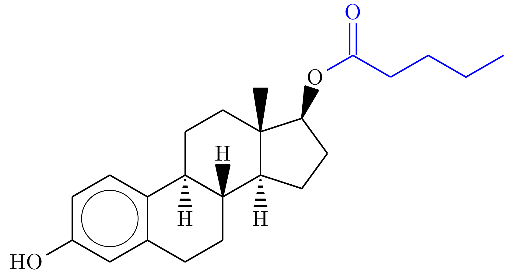

Estradiol valerate is a prodrug metabolized by enzymatic hydrolysis into the fatty acid (shown in blue) and Estradiol (shown in black) the active component in feminizing HRT

#### Methods

Progynova tablets presumably containing estradiol valerate were purchased via eBay from gtxl7863 (a now shutdown seller, eBay does not permit the selling of pharmaceuticals) after a brief interview with seven (7) trans individuals who had, or who knew someone that had, procured HRT outside of a doctors prescription to confirm eBay was a reasonable venue for realistic analysis. Each tablet was powdered and dissolved in methanol (methanol and tablet quantification via weighing by difference). The samples were then sonicated at 60℃ for 36 hours to completely dissolve the tablets before filtering through a 20μm filter to remove any debris. The samples were then analyzed primarily via GC MS for quantification and secondarily via UV/Vis and IR spectroscopy to identify future quantification avenues. Samples were run on an Agilent J&W DB-5ht nonpolar column ((5%-phenyl)-methylpolysiloxane, 30m, 0.25 mm. 0.10 µm, 7 inch cage) with a general purpose method consisting of a 7 minute hold at 160℃, a ramp to 260℃ at 10℃/min to hold for 4 minutes and a 10℃/min ramp to 300℃.

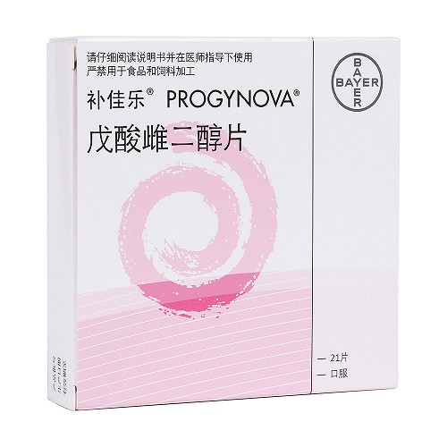


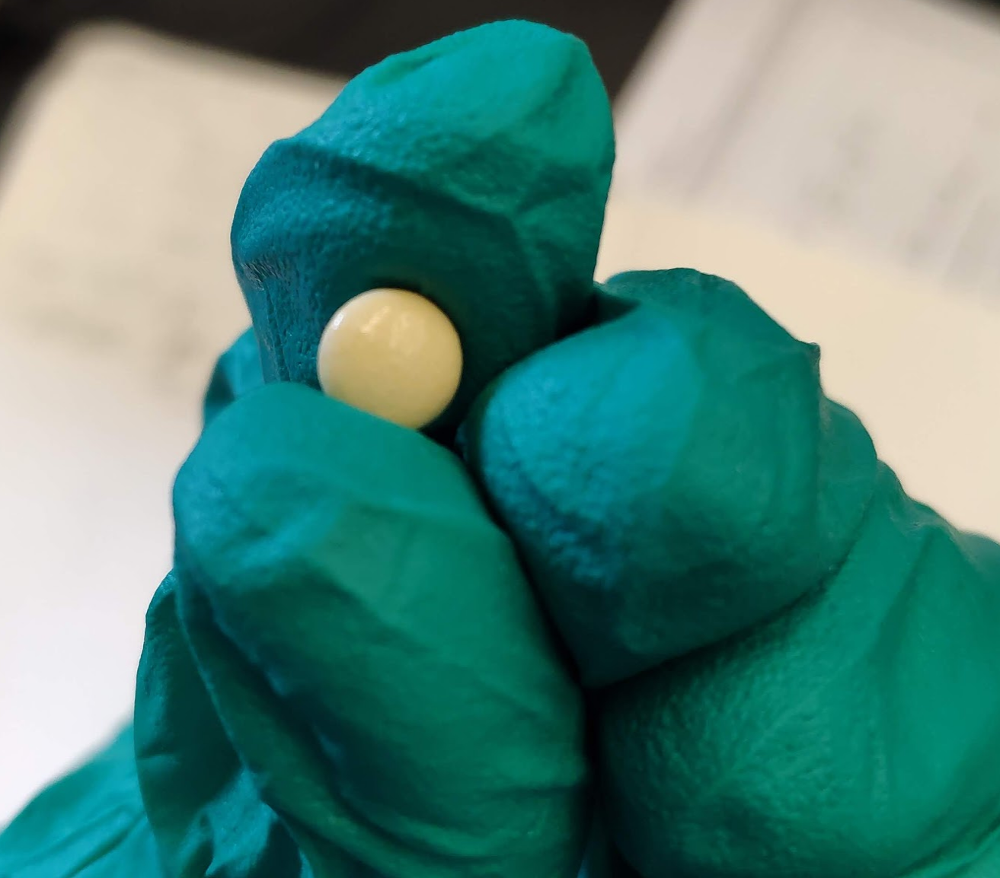

#### Data

This section was not on the original poster. As mentioned above, my off-by-ten attempt to replicate the calculations done here can be seen [here](./estradiol/CHEM-134-Validation.html).

| Pill | GCMS Area   | Concentration (mg/mL) | Powdered Pill in Sample (g) | Initial Pill Weight | Estimated Estradiol Valerate in Pill (mg) | Confidence Interval (mg)|
|------|-------------|-----------------------|-----------------------------|---------------------|-------------------------------------------|---------------------|
| 1    | 6761580.64  | 0.10318               | 0.0977                      | 0.1445              | 1.52694                                   | 0.05206             |
| 2    | 6107657.14  | 0.09371               | 0.1093                      | 0.1395              | 1.19717                                   | 0.04493             |
| 3    | 6153476.16  | 0.09437               | 0.0951                      | 0.1313              | 1.30907                                   | 0.0486              |
| 4    | 6179034.76  | 0.09474               | 0.1017                      | 0.136               | 1.27196                                   | 0.04707             |
| 5    | 6975218.59  | 0.10627               | 0.1207                      | 0.1394              | 1.22867                                   | 0.04065             |
| 6    | 7355210.59  | 0.11177               | 0.1204                      | 0.1355              | 1.26107                                   | 0.03961             |
| 7    | 8286964.05  | 0.12527               | 0.1069                      | 0.1288              | 1.51011                                   | 0.04241             |
| 8    | 10433601.48 | 0.15635               | 0.1286                      | 0.1428              | 1.74431                                   | 0.03909             |
| 9    | 7987559.16  | 0.12093               | 0.1242                      | 0.1409              | 1.37337                                   | 0.03993             |
| 10   | 7206660.82  | 0.10962               | 0.1267                      | 0.1361              | 1.17814                                   | 0.03781             |

The raw data is also available [here](./estradiol/134-data-raw.csv) as a csv file.

#### Results

We quantified ten estradiol valerate tablets. While their reported estradiol valerate content was 1 mg/tablet, we instead found their estradiol valerate content to be on average 1.36 mg/tablet with a variance of 0.0295 mg^2^. We identified no correlation (R^2^=0.25) between either tablet weight and estradiol content or peak area. See below for tablet quantification distribution.

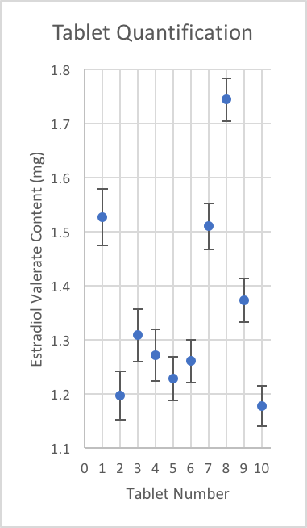


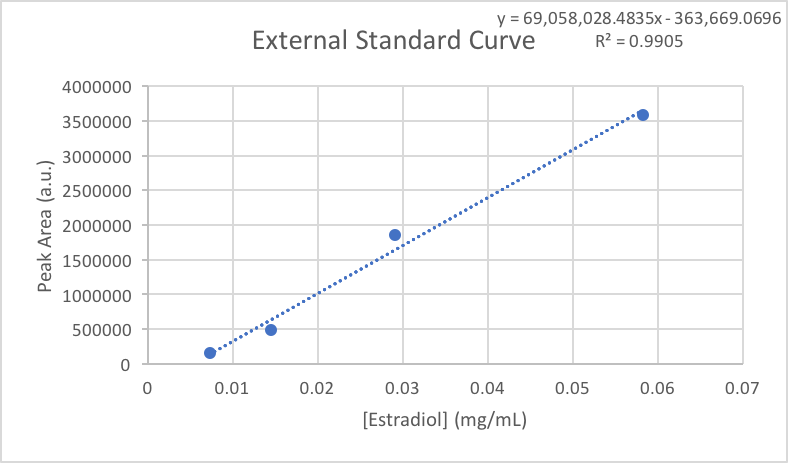

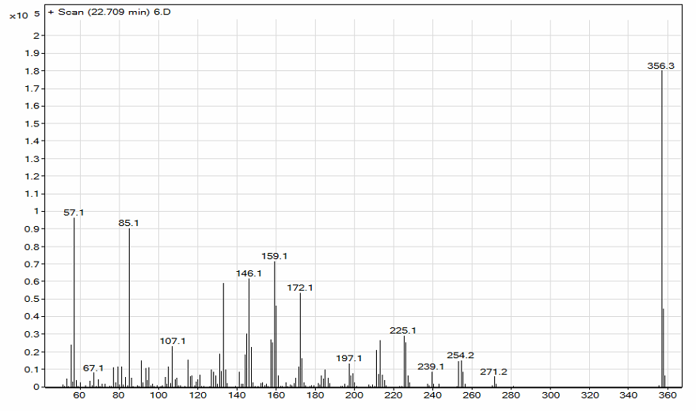

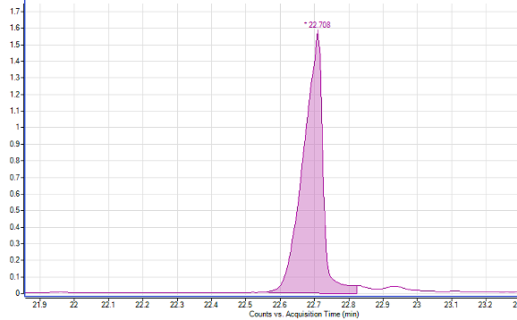

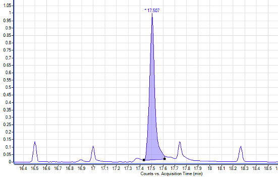

We also briefly explored UV/Vis and IR spectrometry as an alternative analysis method as it is both cheaper and faster than GCMS. While IR showed no peaks for quantification of an estradiol standard,  UV/Vis spectroscopy did, with a peak at 289 nm having a linear dependence on solution concentration (n=4, R2=0.9958). However, the same absorbance peak was not identified in estradiol valerate nor did we have enough estradiol samples to analyze a real world example for a proof-of-concept.

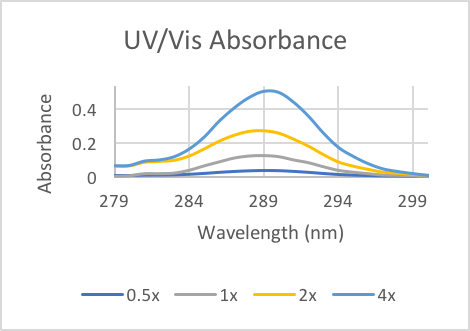

#### Conclusion // Future Work

We have found the estradiol valerate content of grey market HRT tablets to greatly differ from their reported values. While it is still unclear as to the effects of varying dosage on transitioning, it is known that varying estradiol supplements in postmenopausal women increases risk for deep vein thrombosis which is not uncommonly fatal[^Townsend]. For these reasons, it is very important that further work is done to determine the risk associated with “DIY” HRT. We have found that UV/Vis spectroscopy is a promising avenue for continuing quantification of different grey market HRT alternatives that contain estradiol (but not estradiol valerate) without the cost and time associated with GCMS.

**This class project was funded by Stanford University and any generated IP is open sourced under a [LICENSE].**


[^Duumlsterberg]: B. Duumlsterberg, M. Schmidt-Gollwitzer, and M. Huumlmath-semicolonmpel, “Pharmacokinetics and biotransformation of estradiol valerate in ovariectomized women,” Hormone Research, vol. 21, no. 3, pp. 145–154, 1985

[^FDA]: T. U. S. F. D. Administration, “Fda drug shortages.” https://www.accessdata.fda.gov/scripts/drugshortages/dsp_ActiveIngredientDetails.cfm?AI=Estradiol%20Valerate%20Injection,%20USP&st=c

[^them.]: C. Nast, “How an estrogen shortage is making life hell for trans femmes.” https://www.them.us/story/estrogen-shortage-estradiol-valerate.

[^IJoT]: Coleman et, al. “Standards of care for the health of transsexual, transgender, and gender-nonconforming people, version 7,” International Journal of Transgenderism, vol. 13, pp. 165–232, Aug. 2012

[^Townsend]: M. Townsend, H. Jaffer, and L. Goldman, “Adverse health outcomes in transgender people,” Canadian Medical Association Journal, vol. 189, pp. E1046–E1046, Aug. 2017

[^Unger2016]: Unger, Cécile A. “Hormone therapy for transgender patients.” Translational andrology and urology vol. 5,6 (2016): 877-884. doi:10.21037/tau.2016.09.04

[^WPATHv7]: The World Professional Association for Transgender Health "Standards of Care for the Health of Transsexual, Transgender, and Gender Nonconforming People" vol 7 (2012) [www.wpath.org/media/cms/Documents/SOC v7/Standards of Care_V7 Full Book_English.pdf](https://www.wpath.org/media/cms/Documents/SOC v7/Standards of Care_V7 Full Book_English.pdf)

[Liu 2006]: https://sci-hub.tw/https://www.nature.com/articles/nprot.2006.38

[Alsager 2015]: https://pubs.acs.org/doi/full/10.1021/acs.analchem.5b00335?src=recsys

