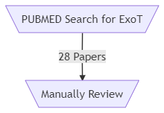

[{{doi | replace("\\", "/")}}](https://doi.org/{{doi | replace("\\", "/")}}) [&#x1D54A;](https://sci-hub.tw/{{doi | replace("\\", "/")}})

[PMCID: {{pmid}}](https://www.ncbi.nlm.nih.gov/pmc/articles/{{pmid}}/)

# Exonuclease T Literature Review

**[introduction//motivation//goals]**

[[toc]]

## Methodology

A PubMed search for various names for Exonuclease T (rnase t, ribonuclease t, exo t, exoribonuclease T and exonuclease T)  in abstracts, titles and section titles of archived papers via a [pubmed query](https://www.ncbi.nlm.nih.gov/pmc/?term=((((((((((((((((((%22exo+T%22%5BAbstract%5D)+OR+%22exoribonuclease+T%22%5BAbstract%5D)+%22exonuclease+T%22%5BAbstract%5D)+OR+%22ribonuclease+t%22%5BAbstract%5D)+OR+%22rnase+t%22%5BAbstract%5D)+OR+%22exo+T%22%5BTitle%5D)+OR+%22exoribonuclease+T%22%5BTitle%5D)+OR+%22ribonuclease+t%22%5BTitle%5D)+OR+%22exonuclease+T%22%5BTitle%5D)+OR+%22rnase+t%22%5BTitle%5D)+OR+%22exo+T%22%5BSection+Title%5D)+OR+%22exoribonuclease+T%22%5BSection+Title%5D)+OR+%22ribonuclease+t%22%5BSection+Title%5D)+OR+%22exonuclease+T%22%5BSection+Title%5D))+OR+%22rnase+t%22%5BSection+Title%5D)+NOT+%22ribonuclease+T1%22)+NOT+%22rnase+T1%22)+NOT+%22TREX1%22)[^pubmed-query] excluding confounding terms (ribonuclease T1, rnase t1 and TREX1) returned 28 papers on March 10th, 2020. After manual inspection, this pool was reduced to [INSERT # OF USEFUL PAPERS HERE]. Our summaries of these papers can be found here, along with our conclusions on the current state of the literature.


```uml
graph TD
	A[\PUBMED Search for ExoT/] -->|28 Papers| B[\Manually Review/]
```


## Papers

Review Format:

```markdown
### Title (Publication Date)
Author(s):

[summary // commentary // data // etc.]

{doi("10.1093\\nar\\gkz133")} (with two curly brackets)

{pmid("PMC6468291")}
```

### Dual expression of CCA-adding enzyme and RNase T in Escherichia coli generates a distinct cca growth phenotype with diverse applications (2019)
**Authors:** Karolin Wellner, Marie-Theres Pöhler, Heike Betat, Mario Mörl  **Reviewer**: Gwyn

{{doi("10.1093\\nar\\gkz133")}} 

{{pmid("PMC6468291")}}

### Examining tRNA 3′-ends in Escherichia coli: teamwork between CCA-adding enzyme, RNase T, and RNase R
Karolin Wellner, Andreas Czech, Zoya Ignatova, Heike Betat, Mario Mörl
RNA. 2018 Mar; 24(3): 361–370.  doi: 10.1261/rna.064436.117
PMCID: PMC5824355

### Endonucleolytic cleavages by RNase E generate the mature 3′ termini of the three proline tRNAs in Escherichia coli
Bijoy K. Mohanty, Jessica R. Petree, Sidney R. Kushner
Nucleic Acids Res. 2016 Jul 27; 44(13): 6350–6362.  Published online 2016 Jun 10. doi: 10.1093/nar/gkw517
PMCID: PMC5291269

### The cutting edges in DNA repair, licensing, and fidelity: DNA and RNA repair nucleases sculpt DNA to measure twice, cut once
Susan E. Tsutakawa, Julien Lafrance-Vanasse, John A. Tainer
DNA Repair (Amst) Author manuscript; available in PMC 2015 Jul 1.Published in final edited form as: DNA Repair (Amst). 2014 Jul; 19: 95–107. Published online 2014 Apr 19.  doi: 10.1016/j.dnarep.2014.03.022
PMCID: PMC4051888

###  Mycobacterium tuberculosis Rv2179c Protein Establishes a New Exoribonuclease Family with Broad Phylogenetic Distribution
Jan Abendroth, Anja Ollodart, Emma S. V. Andrews, Peter J. Myler, Bart L. Staker, Thomas E. Edwards, Vickery L. Arcus, Christoph Grundner
J Biol Chem. 2014 Jan 24; 289(4): 2139–2147.  Published online 2013 Dec 4. doi: 10.1074/jbc.M113.525683
PMCID: PMC3900960

###  Deregulation of poly(A) polymerase I in Escherichia coli inhibits protein synthesis and leads to cell death
Bijoy K. Mohanty, Sidney R. Kushner
Nucleic Acids Res. 2013 Feb; 41(3): 1757–1766.  Published online 2012 Dec 14. doi: 10.1093/nar/gks1280
PMCID: PMC3561954

###  Gateway Role for rRNA Precursors in Ribosome Assembly
Nancy S. Gutgsell, Chaitanya Jain
J Bacteriol. 2012 Dec; 194(24): 6875–6882.  doi: 10.1128/JB.01467-12
PMCID: PMC3510557

###   Role of precursor sequences in the ordered maturation of E. coli 23S ribosomal RNA
Nancy S. Gutgsell, Chaitanya Jain
RNA. 2012 Feb; 18(2): 345–353.  doi: 10.1261/rna.027854.111
PMCID: PMC3264920

###   Processing of the Escherichia coli leuX tRNA transcript, encoding tRNALeu5, requires either the 3′→5′ exoribonuclease polynucleotide phosphorylase or RNase P to remove the Rho-independent transcription terminator
Bijoy K. Mohanty, Sidney R. Kushner
Nucleic Acids Res. 2010 Jan; 38(2): 597–607.  Published online 2009 Nov 11. doi: 10.1093/nar/gkp997
PMCID: PMC2811032

###   Crystal Structure of RNase T, an exoribonuclease involved in tRNA maturation and end-turnover
Yuhong Zuo, Heping Zheng, Yong Wang, Maksymilian Chruszcz, Marcin Cymborowski, Tatiana Skarina, Alexei Savchenko, Arun Malhotra, Wladek Minor
Structure. Author manuscript; available in PMC 2008 Apr 1.Published in final edited form as: Structure. 2007 Apr; 15(4): 417–428.  doi: 10.1016/j.str.2007.02.004
PMCID: PMC1907377

###   Exoribonuclease superfamilies: structural analysis and phylogenetic distribution
Yuhong Zuo, Murray
 P. Deutscher
Nucleic Acids Res. 2001 Mar 1; 29(5): 1017–1026.  doi: 10.1093/nar/29.5.1017
PMCID: PMC56904

###   The DNase activity of RNase T and its application to DNA cloning.
Y Zuo, M P Deutscher
Nucleic Acids Res. 1999 Oct 15; 27(20): 4077–4082.  doi: 10.1093/nar/27.20.4077
PMCID: PMC148676

###   Identification of RNase T as a high-copy suppressor of the UV sensitivity associated with single-strand DNA exonuclease deficiency in Escherichia coli.
M Viswanathan, A Lanjuin, S T Lovett
Genetics. 1999 Mar; 151(3): 929–934.  
PMCID: PMC1460521

###   The proofreading domain of Escherichia coli DNA polymerase I and other DNA and/or RNA exonuclease domains.
M J Moser, W R Holley, A Chatterjee, I S Mian
Nucleic Acids Res. 1997 Dec 15; 25(24): 5110–5118.  doi: 10.1093/nar/25.24.5110
PMCID: PMC147149

###   The gene for the longest known Escherichia coli protein is a member of helicase superfamily II.
N B Reuven, E V Koonin, K E Rudd, M P Deutscher
J Bacteriol. 1995 Oct; 177(19): 5393–5400.  doi: 10.1128/jb.177.19.5393-5400.1995
PMCID: PMC177343

###   The tRNA processing enzyme RNase T is essential for maturation of 5S RNA.
Z Li, M P Deutscher
Proc Natl Acad Sci U S A. 1995 Jul 18; 92(15): 6883–6886.  doi: 10.1073/pnas.92.15.6883
PMCID: PMC41434

###   RNase T shares conserved sequence motifs with DNA proofreading exonucleases.
E V Koonin, M P Deutscher
Nucleic Acids Res. 1993 May 25; 21(10): 2521–2522.  doi: 10.1093/nar/21.10.2521
PMCID: PMC309564

###   The presence of only one of five exoribonucleases is sufficient to support the growth of Escherichia coli.
K O Kelly, M P Deutscher
J Bacteriol. 1992 Oct; 174(20): 6682–6684.  doi: 10.1128/jb.174.20.6682-6684.1992
PMCID: PMC207653

###   RNase T affects Escherichia coli growth and recovery from metabolic stress.
K P Padmanabha, M P Deutscher
J Bacteriol. 1991 Feb; 173(4): 1376–1381.  doi: 10.1128/jb.173.4.1376-1381.1991
PMCID: PMC207273

###   Localization of the Escherichia coli rnt gene encoding RNase T by using a combination of physical and genetic mapping.
L M Case, X N Chen, M P Deutscher
J Bacteriol. 1989 Oct; 171(10): 5736–5737.  doi: 10.1128/jb.171.10.5736-5737.1989
PMCID: PMC210422

###   tRNA nucleotidyltransferase is not essential for Escherichia coli viability.
L Zhu, M P Deutscher
EMBO J. 1987 Aug; 6(8): 2473–2477.  
PMCID: PMC553656

###   RNase T is responsible for the end-turnover of tRNA in Escherichia coli.
M P Deutscher, C W Marlor, R Zaniewski
Proc Natl Acad Sci U S A. 1985 Oct; 82(19): 6427–6430.  doi: 10.1073/pnas.82.19.6427
PMCID: PMC390729

###   Ribonuclease T: new exoribonuclease possibly involved in end-turnover of tRNA.
M P Deutscher, C W Marlor, R Zaniewski
Proc Natl Acad Sci U S A. 1984 Jul; 81(14): 4290–4293.  doi: 10.1073/pnas.81.14.4290
PMCID: PMC345573

Discovery of Exo. T

## Not about Exonuclease T

### Novel EXO-T vaccine using polyclonal CD4+ T cells armed with HER2-specific exosomes for HER2-positive breast cancer
Rong Li, Rajni Chibbar, Jim Xiang
Onco Targets Ther. 2018; 11: 7089–7093.  Published online 2018 Oct 17. doi: 10.2147/OTT.S184898
PMCID: PMC6200095

**Not about Exonuclease T**

### In This Issue

Protein Sci. 2015 Dec; 24(12): v.  Published online 2015 Nov 25. doi: 10.1002/pro.2847
PMCID: PMC4815225

**Not about Exonuclease T**

###   Nucleotide sequence of formylmethionine tRNA from an extreme thermophile, Thermus thermophilus HB 8
Kimitsuna Watanabe, Yoshiyuki Kuchino, Ziro Yamaizumi, Mayumi Kato, Tairo Oshima, Susumu Nishimura
Nucleic Acids Res. 1978 Jul 1; 5(Suppl 2): s473–s478.  doi: 10.1093/nar/1.suppl_2.s473
PMCID: PMC6581399

**Not about Exonuclease T**

###   Leaving-group effects on the ribonuclease T 1 -catalyzed transphosphorylation of specific substrates
Mitsuhiro Itaya, Yasuo Inoue
Nucleic Acids Res. 1978 Jul 1; 5(Suppl 2): s397–s402.  doi: 10.1093/nar/1.suppl_2.s397
PMCID: PMC6581318

**Not about Exonuclease T**

###  Nucleotide sequence complexities, molecular weights, and poly(A) content of the vesicular stomatitis virus mRNA species.
J K Rose, D Knipe
J Virol. 1975 Apr; 15(4): 994–1003.  
PMCID: PMC354544

**Not about Exonuclease T**


[^pubmed-query]: [(((((((((((((((((("exo T"[Abstract]) OR "exoribonuclease T"[Abstract]) "exonuclease T"[Abstract]) OR "ribonuclease t"[Abstract]) OR "rnase t"[Abstract]) OR "exo T"[Title]) OR "exoribonuclease T"[Title]) OR "ribonuclease t"[Title]) OR "exonuclease T"[Title]) OR "rnase t"[Title]) OR "exo T"[Section Title]) OR "exoribonuclease T"[Section Title]) OR "ribonuclease t"[Section Title]) OR "exonuclease T"[Section Title])) OR "rnase t"[Section Title]) NOT vaccine) NOT "ribonuclease T1") NOT "rnase T1") NOT "TREX1")](https://www.ncbi.nlm.nih.gov/pmc/?term=((((((((((((((((((%22exo+T%22%5BAbstract%5D)+OR+%22exoribonuclease+T%22%5BAbstract%5D)+%22exonuclease+T%22%5BAbstract%5D)+OR+%22ribonuclease+t%22%5BAbstract%5D)+OR+%22rnase+t%22%5BAbstract%5D)+OR+%22exo+T%22%5BTitle%5D)+OR+%22exoribonuclease+T%22%5BTitle%5D)+OR+%22ribonuclease+t%22%5BTitle%5D)+OR+%22exonuclease+T%22%5BTitle%5D)+OR+%22rnase+t%22%5BTitle%5D)+OR+%22exo+T%22%5BSection+Title%5D)+OR+%22exoribonuclease+T%22%5BSection+Title%5D)+OR+%22ribonuclease+t%22%5BSection+Title%5D)+OR+%22exonuclease+T%22%5BSection+Title%5D))+OR+%22rnase+t%22%5BSection+Title%5D)+NOT+%22ribonuclease+T1%22)+NOT+%22rnase+T1%22)+NOT+%22TREX1%22))


