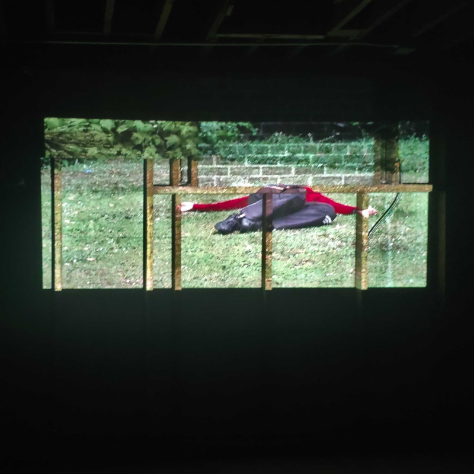
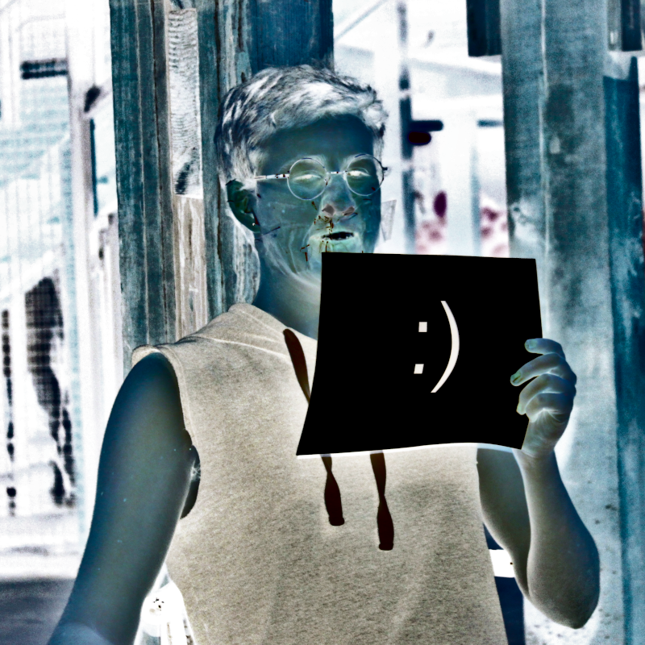

# WYOMING BODY

[toc]

## EMULATION A :: August 10th, 2021

> "The mirror stage is a phenomenon to which I assign a twofold value. In the first place, it has historical value as it marks a decisive turning-point in the mental development of the child. In the second place, it typifies an essential libidinal relationship with the body image." *Some reflections on the Ego* by Lacan (1953)

### SETTING: GROUP NORMS

### PRACTICE: SEEING

Questions to consider:

[Exercise, cont. from Aug. 3rd]

### PERFORMANCE

[LIVE PERFORMANCE]

### PRACTICE: EMULATION

#### SLOW FALLS (2011), ABIGAIL LEVINE

](./1/slow-falls.jpg)

>Slow Falls is a work for three dancers who mark increasingly slow descents down a building exterior. Each dancer completes four falls over the course of 100 minutes — the shortest lasting 5 minutes, the longest 50. The dancers mark their 'falls' with colored tape, leaving a record of their movement and becoming for a time a new element in the movement and architecture of the environment.  [Source](http://www.abigaillevine.com/works/slow-falls-2011)

1. Split into pairs
1. Take turns performing Slow Falls for 30 seconds each
1. Take turns performing Slow Falls for 2 minutes each
1. Take turns performing Slow Falls for 10 minutes each

### STUDY

#### SEMIOTICS OF THE KITCHEN (1975), MARTHA ROSLER

> "In this performance Rosler takes on the role of an apron-clad housewife and parodies the television cooking demonstrations popularized by Julia Child in the 1960s. Standing in a kitchen, surrounded by refrigerator, table, and stove, she moves through the alphabet from A to Z, assigning a letter to the various tools found in this domestic space. Wielding knives, a nutcracker, and a rolling pin, she warms to her task, her gestures sharply punctuating the rage and frustration of oppressive women's roles. Rosler has said of this work, "I was concerned with something like the notion of 'language speaking the subject,' and with the transformation of the woman herself into a sign in a system of signs that represent a system of food production, a system of harnessed subjectivity." (Text from video description)

[VIDEO](https://www.youtube.com/watch?v=ZuZympOIGC0)

### FOOD FOR THOUGHT

#### WATCH

The Art Assignment, [*The Case for Performance Art*](https://www.youtube.com/watch?v=EmMTKdUAokM) (9m)

#### READ

**Chapter 2: Performance Histories**, [*Performance*](https://www.dukeupress.edu/performance) by Diana Taylor (also available in [spanish](https://www.amazon.com/PERFORMANCE-Spanish-DIANA-TAYLOR/dp/9505330251))

#### DO

Give a piece of your body to someone else for a day. Then retrieve it.

## ANXIETY :: August 3rd, 2021

> "To be an artist, one must have a wide expressive range and a profound desire to communicate. That desire to communicate has to be larger than the chains that bind. ... A dancers jump is notable because it's *against* gravity."    *Letters to a Young Artist* by Anna Deavere Smith pg. 157-8

### PERFORMANCE

### PRACTICE: SEEING

After the performance, write your spontaneous reflections for five minutes by hand on this paper. At the end of five minutes, we'll discuss as a group, but these notes are for you. Write whatever you want :)

### PRACTICE: INTRODUCTIONS

Walk around the room briskley and introduce yourself to the others when you run into them. Do not introduce yourself the same way twice. 

### STUDY

#### IMPACT AFGANISTAN WAR (2010), HELENE VOSTERS

](./1/impact-afganistan-war.jpg)

> "Helene Vosters (Canada) fell one hundred times a day for an entire year, starting on Canada Day (July 1) of 2010—a meditation, she says, on the deaths in Afghanistan. The number of deaths kept creeping up, and she felt she couldn’t feel, couldn’t connect. The falling served as a sustained meditation. It made it impossible for her to go through a day without thinking about war. She had to organize her life around the falls: where she would be, safety, weather, clothing. A note to witnesses, written on a postcard of the Canadian flag, explains that her falls are her attempt to “reach beyond the numbness produced by abstract numbers, political debates, and media spectacularization.” On July 1, 2011, she closed the performance with a group fall." - Performance, Diana Taylor (pg. 22-3)

[VIDEO](https://www.youtube.com/watch?v=i0Rxn3UMmX8)

[Record of Falls](https://helenevosters.com/about/record-of-falls-unless-otherwise-noted-all-falls-were-video-documented-by-cassie-scott/)

#### SLOW FALLS (2011), ABIGAIL LEVINE

](./1/slow-falls.jpg)

>Slow Falls is a work for three dancers who mark increasingly slow descents down a building exterior. Each dancer completes four falls over the course of 100 minutes — the shortest lasting 5 minutes, the longest 50. The dancers mark their 'falls' with colored tape, leaving a record of their movement and becoming for a time a new element in the movement and architecture of the environment. 
>
> ""By no means monumental, the marks seem instead to linger in space with a kind of lightness and transience… They intervene in the disappearance of the performance I have described in order to take a stand for the time marked and work performed." - Joy Kristin Kalu in Embodying, Repeating, and Working-Through [Source](http://www.abigaillevine.com/works/slow-falls-2011)

[VIDEO](https://vimeo.com/85403134)

#### BECOMING AN IMAGE (2012), HEATHER CASSILS

](./1/becoming-an-image.jpg)

> Becoming An Image is a new body of work consisting of a live performance, photographs, a sculpture and an audio piece. The performance is designed for the camera, specifically the act of being photographed. Taking place in a blacked out room, the only elements in the space are the audience, a photographer, the performer and a block of clay weighing 1500 pounds (around the same height and width of a body). In the darkness, I use my skills as a boxer/ MMA fighter to unleashing an assault  where I literally beat the material, moulding the form. A "sculpting" process results on account of my blows. For the duration of this performance I am blind, as is the audience, as is the photographer. The only light source emitted comes from the flash mounted on the photographer's camera. This burst of temporary light allows the audience to glimpse at suspended moments of the performance, much like a "live" photograph, burning this image into their retina, which leave ghost like traces. The act of photographing is the only way in which the performance is made visible. 
>
> Originally commissioned  by the ONE Archives (the oldest active Lesbian, Gay, Bisexual, Transgender, Queer, Questioning (LGBTQ) organization in the United States.)  Becoming an Image addressed LGBTQ archives and the "Ts" and "Qs" often missing from historical records, which exist outside of the lens. BAI brings forth the idea of accountability by directly address the role between artist and photographer.  Additionally it calls into question the roles of the witness, the aggressor and documenter by building these challenges into the very act of the performance itself. (From video below)

[VIDEO](https://www.youtube.com/watch?v=TzM8GTL2WGo)

#### MONSANTO AND THE CARNIVAL OF CORN, THE YESMEN

Background information about the Yes Men:  

>"Andy Bichlbaum and Mike Bonanno (Jacques Servin and Igor Vamos, respectively) are the Yes Men, artivists who parody powerful corporate leaders and spokesmen through what they call identity correction, that is, “impersonating big-time criminals in order to publicly humiliate them, and otherwise giving journalists excuses to cover important issues.” Since 1999, they have been getting into all sorts of trouble, impersonating a spokesperson from Dow Chemical on the bbc NewsHour, another from Halliburton, yet another claiming to be from the U.S. Chamber of Commerce, and so on. During these impersonations, the two often build false hope that companies will finally do the right thing (recompense the victims of the Bhopal disaster in Dow’s case) or that the U.S. Chamber of Commerce would support environmental legislation. When the organizations rushed to declare that in fact the announcements were a hoax, that they had no intention of doing the right thing, they fell into what is known as a “decision dilemma”—the “damned if you do and damned if you don’t” gold standard for activists. The “target” looks ridiculous no matter what it does. The Chamber of Commerce was so incensed at the Yes Men that they sued them. As the lawsuit dragged on and on, the Chamber finally gave up its suit. The Yes Men then sued them back, for dropping the suit. Dow was too savvy to fall for the suing trick, but they did send “spies,” as Servin calls them, to keep track of the Yes Men’s doing." - Performance, Diana Taylor (pg. 174-175)

](./1/yes-men.png)

>[Exerpted from above] *MEXICO CITY (Aug 14, 2013): The planting of genetically modified (gm) corn fields on a large commercial scale has been approved by the Mexican Secretariat of Agriculture (sagarpa). The permit allows the planting of 250,000 hectares of three varieties of gm corn (mon-89034-3, mon-00603-6 and mon-88017-3) in the states of Chihuahua, Coahuila and Durango. This is the first time gm corn will have been planted on a large commercial scale in Mexico.*

> "In true YesMen fashion, we launched a fake website claiming to be Monsanto’s. Monsanto had requested permission from Sagarpa, the secretariat of agriculture in Mexico, to plant gm corn commercially. The answer to the request was expected at any moment. Our press release, on the fake Monsanto website, announced that the request had been granted and thanked all those people in government for their invaluable help in moving Monsanto’s interests along to fruition. We, of course, thanked them by name and cc’ed them in our communiqué.
> The release went on to add that Monsanto, aware that critics would decry the threat to the diversity of corn in Mexico,
contaminated or displaced by the gm crops, would enact certain measures. “One such initiative is the National Seed Vault (Bóveda Nacional de Semillas, bns), whose charter is to safeguard the 246 native Mexican corn strains from ever being fully lost.” The “fully” lost, we felt, was a nice touch. Another initiative, we claimed, was the creation of the “Codex
Mexico (Codice México), a digital archive preserving the vast wealth of Mexican culture for centuries to come. ‘The Codex Mexico is a visionary initiative that will allow future generations of children to know far more about our lives today than we know of our pre-Columbian ancestors,’ noted forensic anthropologist Marcelo Rodríguez Gutiérrez. ‘Never again will  the wealth of this region’s culture be lost as social conditions change.’” The new conquest would be kinder and less devastating than the last.

>Monsanto, faced with the decision dilemma of responding to or ignoring the prank, did not take long to respond. Within twenty minutes they had us on the phone demanding that we take our hoax site down. They immediately released a disclaimer. Nothing in the last press release was true. We, as requested, then issued our own disclaimer, saying that nothing in the last press release was true, and that led to a wonderful general confusion. Given the widespread activism around the gmo issue, we were leaked an email that Monsanto had just sent to Sagarpa, apologizing for the confusion and promising to get things under control. Monsanto reiterated the need for
confidentiality.

>On September 13, 2013, Monsanto contacted the president of NYU to complain about the street and digital action. They wanted to know about the course, see the syllabus, and understand the relationship of the actions to nyu. They also wanted an apology from NYU. This created a new drama, one that dominated our fall semester 2013 at NYU. NYU questioned Servin and me. Phrases such as “code of ethics,” “academic freedom,” and “conflict of interest” came up. Apparently, our action had placed us on the wrong side of each. We stressed that the digital action had nothing to do with NYU. We had a few questions of our own. what did Monsanto object to—the street action or the digital action? How is impersonation on the street different from impersonation online? How had our action harmed Monsanto? Really? (It was just play.) Wouldn’t it be great to organize a conference at nyu to discuss the limits of activism in and at the margins of institutional settings? As for our purported violations we also had questions. Conflict of interest? Us? I asked our officer from NYU who had herself enjoyed an important position at Monsanto. Violation of an ethical code? Define ethics. Polluting the environment and harming humans? Monsanto had seemingly infinite resources and strategies to counter any evidence of wrongdoing against them. All we had, as professors, to shield us was academic freedom. After a few back-and-forths, it seemed that the street action, which was officially related to the course, did not really bother Monsanto. Although no one responded to the questions, I gathered that a few bodies on the street in Chiapas can’t be something to worry about. An Internet action, on the other hand, reaching a far broader audience (including the people who were considering granting permission to Monsanto), was no laughing matter. So it went.

>In October 2013, a local judge in Mexico City prohibited Sagarpa from granting Monsanto permission to plant gm corn in Mexico, either on an experimental, pilot, or commercial basis. A recent ruling reiterated that position.18 Subsequent court rulings have prohibited the planting of gm corn in Central America. Did our digital action prove efficacious? Did we really derail Monsanto’s plans? Although we would love to think so, and still wait for Monsanto to offer “proof” that we hurt them, this hoax was one of thousands of interventions that artists and activists constantly carry out to keep gmos out of Mexico and other countries. But because “others” were doing something, did not mean that we shouldn’t do anything. We were happy to be among people who use their talents to keep bad things from (further) happening.

[DESCRIPTION](https://theyesmen.org/project/monsantoinmexico)

### PRACTICE: FAILURE

Each attendee stands up and is booed aggressively by the audience until they sit down. This will be your worst performance.

### FOOD FOR THOUGHT

#### WATCH

Marina Abramović. [*The Artist Is Present.*](https://www.youtube.com/watch?v=YcmcEZxdlv4) (1h 46m, 2010)

#### READ

**Chapter 1: Framing [Performance]**, [*Performance*](https://www.dukeupress.edu/performance) by Diana Taylor (also available in [spanish](https://www.amazon.com/PERFORMANCE-Spanish-DIANA-TAYLOR/dp/9505330251))

#### DO

**The Pleasure of Being Booed (Performance)**
Attend a performance festival and present a discourse in which you criticise the works of the other artists, until the majority of the audience openly expresses their displeasure by booing you off the floor. The intervention should not be at
the end of the festival or at the end of a night, to avoid the audience simply leaving. Once a critical mass of the audience is booing, the performance terminates.

**Background Data**
One of the problems threatening the viability of performance art as a relevant form is the desire of performance artists to be seen as ethically good, persons of good character, fair, or enlightened.

From [**PERFORMANCE ARTIST'S WORKBOOK: On teaching and learning performance art - essays and exercises.**](https://helda.helsinki.fi/bitstream/handle/10138/224586/TeaK_61.pdf?sequence=1) pg. 30